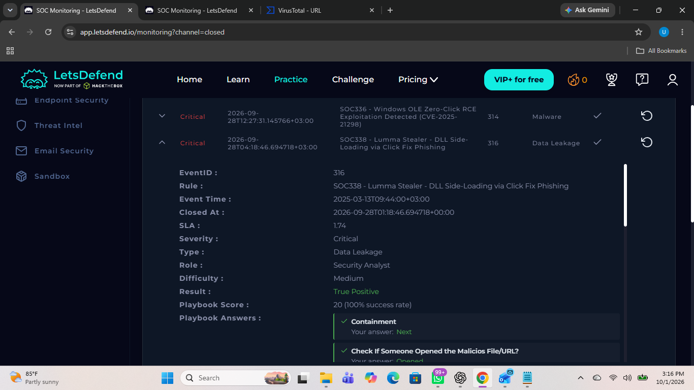
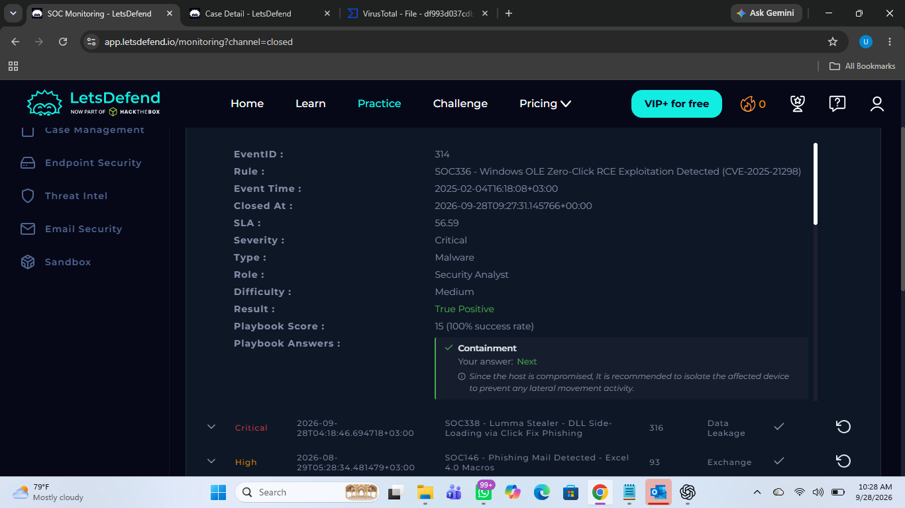
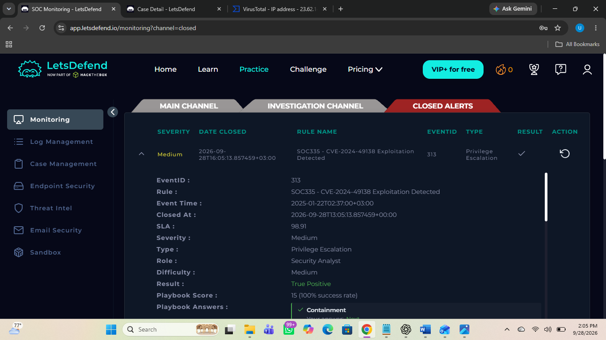
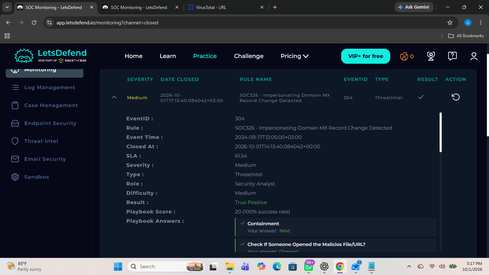
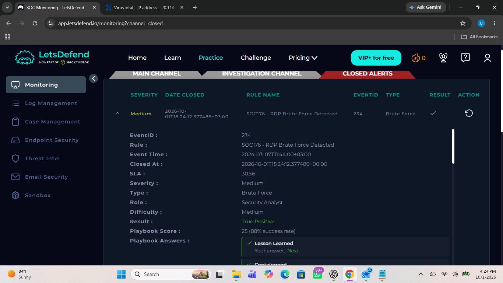
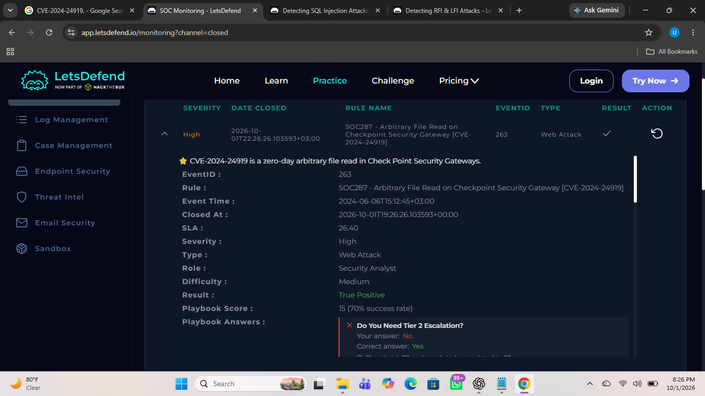
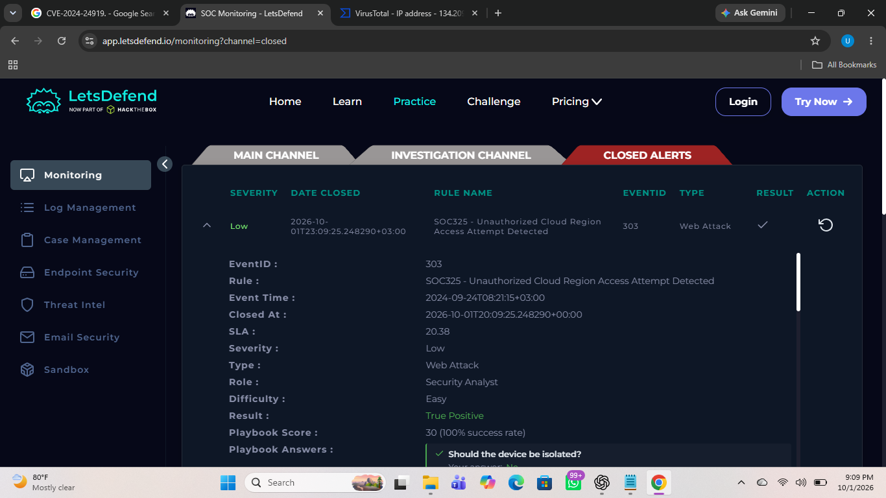
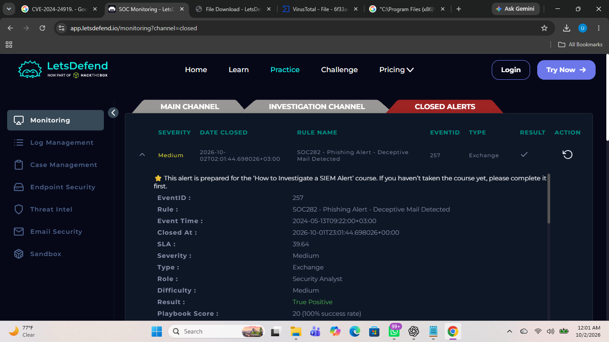
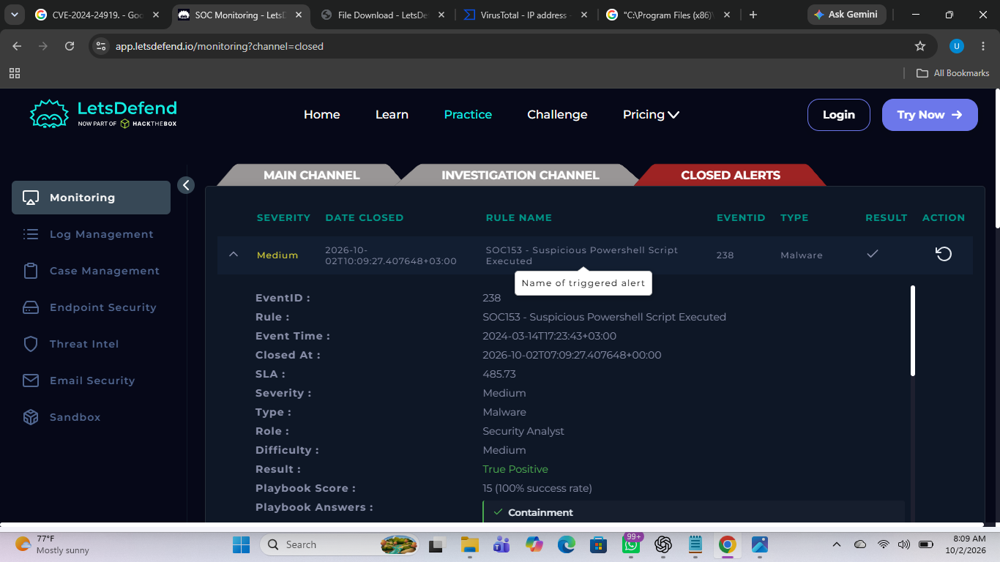

# SOC Alert Triage & Investigation Project

## Project Objective

This project was completed as a practical SOC investigation exercise using the **LetsDefend** platform. The objective was to simulate the workflow of a Security Operations Center (SOC) analyst by reviewing security alerts, performing initial triage, investigating the available evidence, determining the nature and impact of each alert, and documenting the actions taken.

The project consists of **10 security alert investigations**. Each investigation demonstrates the process of moving from an incoming alert to evidence-based analysis, incident determination, and appropriate response actions.

The README provides a summary of each investigation, while the supporting screenshots are stored separately in the `screenshots` directory. The complete investigation report is available in the `reports` directory.

---

# Investigation 01 — Lumma Stealer / ClickFix

**Event ID:** 316

## Incident Details

- **Alert:** Lumma Stealer — ClickFix
- **Event ID:** 316
- **Suspicious URL:** `www.windows-update.site`
- **Source IP:** `132.232.40.201`
- **Recipient:** `dylan@letsdefend.io`
- **Activity:** ClickFix / Lumma Stealer
- **User Interaction:** Confirmed
- **Disposition:** Compromise identified

## Alert Overview

The first investigation involved a **Lumma Stealer ClickFix** alert. The alert indicated suspicious activity associated with a malicious website and a ClickFix technique, where a victim can be socially engineered into performing an action that leads to malware execution.

The alert was investigated to determine whether the activity represented a genuine compromise, identify the relevant indicators and user activity, and determine the appropriate response.

## Triage

The initial triage focused on reviewing the alert information, including the event details, source information, suspicious URL, recipient, and available email/security evidence.

The investigation identified the suspicious domain:

`www.windows-update.site`

The source IP associated with the activity was:

`132.232.40.201`

The investigation also identified the recipient as:

`dylan@letsdefend.io`

The available evidence was reviewed to determine whether the suspicious activity had progressed beyond an attempted delivery and whether the user had interacted with the malicious content.

## Investigation

The investigation showed that the activity was associated with a **ClickFix social-engineering technique** used to facilitate malware execution.

The suspicious website and related indicators were examined, and the available evidence was correlated with the alert information. User interaction was confirmed during the investigation, indicating that the event was not simply an unsuccessful attempt.

The investigation therefore treated the activity as a genuine security incident requiring response and containment.

## Actions Taken

1. Investigated the alert and reviewed the available event information.
2. Examined the suspicious URL and associated source information.
3. Correlated the available evidence to determine whether the user had interacted with the malicious content.
4. Confirmed that user interaction had occurred.
5. Treated the event as a genuine compromise rather than a false positive.
6. Applied containment and response actions based on the investigation findings.

# Investigation 02 — Windows OLE Zero-Click RCE Exploitation Detected (CVE-2025-21298)

**Event ID:** 314

## Incident Details

- **Alert:** Windows OLE Zero-Click RCE Exploitation Detected (CVE-2025-21298)
- **Event ID:** 314
- **Ticket:** SOC336
- **Event Time:** 2025-02-04 04:18:08
- **Role:** Security Analyst
- **Alert Type:** Malware
- **Attachment:** `mail.rtf`
- **SMTP Address:** `84.38.130.118`
- **Device Action:** Allowed
- **Source Address:** `projectmanagement@pm.me`
- **Destination Address:** `Austin@letsdefend.io`
- **Attachment Hash:** `df993d037cdb77a435d6993a37e7750dbbb16b2df64916499845b56aa9194184`
- **E-mail Subject:** Important: Action Required for Upcoming Project Deadline

## Alert Overview

The second investigation involved the exploitation of **CVE-2025-21298**, a Windows OLE zero-click remote code execution vulnerability.

The alert involved a malicious email sent to the user with an RTF attachment. The investigation was performed to determine whether the attachment was malicious, whether the user interacted with it, and whether any activity occurred on the affected device.

## Triage

I first reviewed **CVE-2025-21298** to understand the vulnerability and how it could be exploited.

I then checked the SMTP address `84.38.130.118` against VirusTotal, which confirmed that it was malicious.

Based on these initial findings, I proceeded with a deeper investigation.

## Investigation

I reviewed the email and identified that an attachment had been sent to the user. I investigated the attachment and confirmed that it was malicious.

I then reviewed the relevant logs to determine whether the user had interacted with the malicious file. Using the associated IP address of the malicious file, which was identified as its C2 address, I found log activity pointing to that address. This confirmed that the user had interacted with the malicious file.

Further investigation showed that the file had been executed on the user's device and that a command was executed. The command execution indicated that the affected device had been exposed to a potential security risk.

## Actions Taken

1. Contained the affected device to prevent further malicious activity.
2. Escalated the incident based on the identified IOCs and supporting evidence for further investigation and response actions.

## Screenshot

# Investigation 03 — CVE-2024-49138 Exploitation Detected

**Event ID:** 313

## Incident Details

- **Alert:** CVE-2024-49138 Exploitation Detected
- **Event ID:** 313
- **Rule:** SOC335 - CVE-2024-49138 Exploitation Detected
- **Event Time:** 22/01/2025 02:37:00
- **Role:** Security Analyst
- **Alert Type:** Privilege Escalation
- **Hostname:** Victor
- **File Hash:** `b432dcf4a0f0b601b1d79848467137a5e25cab5a0b7b1224be9d3b6540122db9`
- **IP Address:** `172.16.17.207`
- **Process Name:** `svohost.exe`
- **Process Path:** `C:\temp\service_installer\svohost.exe`
- **Process User:** `EC2AMAZ-ILGVOIN\LetsDefend`
- **Command Line:** `\??\C:\Windows\system32\conhost.exe 0xffffffff -ForceV1`
- **Associated IP:** `23.62.141.251`
- **External Source IP:** `185.107.56.141`

## Alert Overview

The third investigation involved the detection of activity associated with **CVE-2024-49138**. The alert indicated suspicious privilege escalation activity on the Victor hostname.

The investigation focused on correlating authentication, network, and endpoint activity to determine whether the device had been compromised.

## Triage

I first reviewed **CVE-2024-49138** to understand the vulnerability and how it could be exploited. This provided context on what indicators and suspicious activity to look for during the investigation.

I then proceeded with a deeper investigation of the alert and the associated activity.

## Investigation

I first correlated the available authentication logs and identified four failed login attempts from the external source IP `185.107.56.141` against the Victor hostname account within approximately one minute. The attempts returned error code `0xC000006D`, indicating an unknown username or bad password. The activity was consistent with a brute-force attempt.

Following these failed login attempts, I identified a successful logon from the same external IP address. The successful authentication was recorded under **Event ID 4624**, indicating that an account had successfully logged on. The logon used **Logon Type 10 (RemoteInteractive)** and occurred at `22/01/2025 12:35:50`.

I then correlated the activity with the firewall logs and identified an initial network scan from the same source IP. The logs showed traffic directed toward port `3389` from different source ports within the same timeframe, indicating a SYN scan against the network.

I then investigated the endpoint activity through the EDR. I identified the command:

` \??\C:\Windows\system32\conhost.exe 0xffffffff -ForceV1 `

The command was suspicious because `conhost.exe` is the Windows Console Host and is normally located at `C:\Windows\System32\conhost.exe`. The `0xffffffff -ForceV1` arguments, together with the unusual `\??\` prefix, increased the suspicious nature of the execution.

I also identified `svohost.exe` running from:

`C:\temp\service_installer\svohost.exe`

The process path indicated that an executable was running from a temporary service installer directory.

Additional endpoint activity showed that:

`C:\Windows\system32\whoami.exe`

was executed to gather information about the current account.

I also identified Windows Defender activity involving:

`C:\ProgramData\Microsoft\Windows Defender\Platform\4.18.24080.9-0\MpCmdRun.exe Scan -ScheduleJob -RestrictPrivileges -ScanType 1 ScanTrigger 59`

The process was executed with restricted privileges.

Based on the correlated authentication, network, and endpoint activity, I determined that the device had been compromised.

## Actions Taken

1. Contained the affected device to prevent further malicious activity.
2. Escalated the incident for further investigation and response actions.

## Screenshot

# Investigation 04 — Impersonating Domain MX Record Change Detected

**Event ID:** 304

## Incident Details

- **Alert:** Impersonating Domain MX Record Change Detected
- **Event ID:** 304
- **Event Time:** 1/09/2024 12:05:00
- **Role:** Security Analyst
- **Alert Type:** ThreatIntel
- **Domain:** `letsdefwnd[.]io`
- **Subject:** Impersonating Domain MX Record Change Detected
- **MX Record:** `mail.mailerhost[.]net`
- **Device Action:** Allowed
- **Source Address:** `no-reply@cti-report.io`
- **Destination Address:** `soc@letsdefend.io`
- **Trigger Reason:** The MX record of a suspicious domain was changed, suggesting potential phishing activity.

## Alert Overview

The fourth investigation involved an alert concerning an **impersonating domain and an MX record change**. The suspicious domain was designed to resemble the legitimate LetsDefend domain and could potentially be used for phishing activity.

The investigation focused on identifying related email activity and determining whether an internal user had interacted with the malicious infrastructure.

## Triage

I first reviewed the email security logs to determine whether the alert was related to a legitimate phishing simulation or an actual security threat.

No announcement or evidence of a phishing simulation was identified, so I proceeded with a deeper investigation.

## Investigation

I searched the email security logs using the sender and sender domain to identify related email activity. I identified a message from sender IP `172.16.20.3` with the same subject and destination domain, but at a different time, `17/09/2024 10:05:00`.

I identified the following IP addresses associated with the phishing domain:

- `72.14.178.174`
- `45.33.30.197`
- `72.14.185.43`
- `173.255.194.134`
- `45.79.19.196`
- `45.56.79.23`
- `96.126.123.244`
- `45.33.20.235`
- `45.33.18.44`
- `45.33.2.79`
- `198.58.118.167`
- `45.33.23.183`

I then identified another email from the same sender domain, but from a different IP address, `64.233.180.27`, sent to the same destination domain on `22/09/2024 06:19:00`. This email had a different subject: **Compromised Account Alert from CTI**.

I then used one of the IP addresses associated with the phishing domain to investigate whether any internal user had interacted with the malicious infrastructure. The logs showed that an internal host with IP `172.16.17.162` had communicated with `45.33.23.183`, an IP associated with the malicious `letsdefwnd[.]io` domain, on `18/09/2024 at 11:18:32:13`.

The activity occurred after an awareness email had been sent to employees regarding the impersonation.

The logs showed that the user **Mateo** had accessed `https://letsdefwnd.io` using Google Chrome. The connection was allowed and originated from source port `24233` to destination port `443`.

Based on the correlated email and network activity, I confirmed that an employee had interacted with the malicious phishing infrastructure despite the organization having issued an awareness notification.

## Actions Taken

1. Contained the affected user's device to prevent further interaction with the malicious infrastructure.
2. Escalated the incident for further investigation and response actions.

## Screenshot

# Investigation 05 — RDP Brute Force Detected

**Event ID:** 234

## Incident Details

- **Alert:** RDP Brute Force Detected
- **Event ID:** 234
- **Rule:** SOC176 - RDP Brute Force Detected
- **Event Time:** 07/03/2024 11:44:00
- **Role:** Security Analyst
- **Alert Type:** Brute Force
- **Protocol:** RDP
- **Firewall Action:** Allowed
- **Source IP Address:** `218.92.0.56`
- **Alert Trigger Reason:** Login failure from a single source with different non-existing accounts
- **Destination Hostname:** Matthew
- **Destination IP Address:** `172.16.17.148`

## Alert Overview

The fifth investigation involved an **RDP brute-force attack** against the Matthew host. Multiple login attempts using different, non-existing usernames were detected from a single external source.

The investigation focused on determining whether the activity remained an unsuccessful brute-force attempt or whether the attacker eventually gained access to the account.

## Triage

I first investigated the source IP address `218.92.0.56` using VirusTotal to determine whether it had a malicious reputation. The IP was flagged by **5 of 91 security vendors** as malicious.

Based on this finding, I claimed ownership of the event, created a ticket, and proceeded with a deeper investigation.

## Investigation

I investigated the Log Management data and identified multiple failed login attempts using different random usernames. These events generated **Event ID 4625**, indicating that an account failed to log on, with error code `0xC000006D`, indicating an unknown username or bad password.

The activity occurred at `07/03/2024 09:44:16`, prior to the alert generation time.

I then correlated the authentication logs using the timestamp, source IP address, and destination IP address. The correlation revealed that a successful logon subsequently occurred from the same source IP address to the Matthew account at `09:44:59` on the same day.

The successful authentication following multiple failed attempts from the same external malicious IP indicated that the actor had successfully gained access to the user account.

## Actions Taken

1. Contained the device to reduce the risk of lateral movement or further privilege escalation within the network.
2. Escalated the incident for further investigation and response actions.

## Screenshot

# Investigation 06 — Arbitrary File Read on Check Point Security Gateway [CVE-2024-24919]

**Event ID:** 263

## Incident Details

- **Alert:** Arbitrary File Read on Check Point Security Gateway [CVE-2024-24919]
- **Event ID:** 263
- **Event Time:** 06/06/2024 15:12:45
- **Role:** Security Analyst
- **Rule:** SOC287 - Arbitrary File Read on Check Point Security Gateway [CVE-2024-24919]
- **Alert Type:** Web Attack
- **Request:** `aCSHELL/../../../../../../../../../../etc/passwd`
- **Hostname:** `CP-Spark-Gateway-01`
- **User-Agent:** `Mozilla/5.0 (Macintosh; Intel Mac OS X 10.15; rv:126.0) Gecko/20100101 Firefox/126.0`
- **Source IP Address:** `203.160.68.12`
- **Destination IP Address:** `172.16.20.146`
- **Requested URL:** `172.16.20.146/clients/MyCRL`

## Alert Overview

The sixth investigation involved an attempted exploitation of **CVE-2024-24919**, an arbitrary file read vulnerability affecting a Check Point Security Gateway.

The alert showed a directory traversal request attempting to access the Linux `/etc/passwd` file. The investigation focused on determining whether the attempted file read was successful and whether the system had been compromised.

## Triage

I first reviewed the trigger reason and researched the online description of **CVE-2024-24919** to understand the vulnerability and how it could be exploited.

After gaining an understanding of the vulnerability, I proceeded with a deeper investigation.

## Investigation

I investigated the source IP address `203.160.68.12` using VirusTotal, where it was flagged as malicious by three security vendors.

I then reviewed the network activity associated with the alert. The external IP address made repeated requests attempting to access the Linux `/etc/passwd` file through a directory traversal request:

`aCSHELL/../../../../../../../../../../etc/passwd`

The requested resource was associated with `172.16.20.146`, which was identified as a gateway/server with internet connectivity and administrative access.

During the initial investigation, I did not find evidence confirming that the attacker had successfully retrieved the `/etc/passwd` file or gained unauthorized access to the system. The available evidence established that an attack had been attempted, but successful exploitation could not initially be confirmed.

I learned from this investigation that the initial log view may not always provide enough evidence to determine whether an attack was successful. Further investigation of the raw logs was therefore necessary to look for additional indicators of successful activity.

Based on the available evidence, I determined that the attack attempt was identified, but a successful compromise could not be established.

## Actions Taken

1. Closed the alert because there was no evidence of a successful attack or compromise.
2. Did not escalate the alert because the investigation did not establish successful exploitation.

## Lesson Learned

I learned that when a successful event is not immediately visible in the available logs, I should investigate further using the raw logs rather than relying only on the initial log view.

I learned to search for HTTP status code `200`, which can indicate a successful connection, and to correlate the results using the relevant source and destination IP addresses, as well as the specific command or request involved in the investigation.

This deeper search can help identify relevant activity that may not be immediately visible in the standard logs.

## Screenshot

# Investigation 07 — Unauthorized Cloud Region Access Attempt Detected

**Event ID:** 303

## Incident Details

- **Alert:** Unauthorized Cloud Region Access Attempt Detected
- **Event ID:** 303
- **Event Time:** 24/09/2024 08:21:15
- **Role:** Security Analyst
- **Alert Type:** Web Attack
- **Rule:** SOC325 - Unauthorized Cloud Region Access Attempt Detected
- **Username:** `test@letsdefend.io`
- **Request URL:** `POST /accounts/login HTTP/1.1 403 512`
- **Source Address:** `134.209.145.73`
- **Destination Address:** `52.15.206.21`
- **Trigger Reason:** Too many access attempts with the same user were detected in a short period of time from an unauthorized cloud region configured as “unused” or “unsupported”.

## Alert Overview

The seventh investigation involved repeated access attempts against a user account from an unauthorized cloud region.

The investigation focused on determining whether the login attempts resulted in successful unauthorized access or affected another device.

## Triage

I reviewed the alert and identified multiple access attempts against the same user account within a short period from an unauthorized cloud region.

I then checked the source IP address `134.209.145.73` against VirusTotal, where it was flagged as malicious by five security vendors.

Based on these findings, I proceeded with a deeper investigation.

## Investigation

I analyzed the request:

`POST /accounts/login HTTP/1.1 403 512`

The request indicated an attempted login to the account, while the **403 HTTP status code** showed that the request was denied by the server.

I then investigated the destination IP address `52.15.206.21` and identified it as an AWS server.

I reviewed the relevant logs further to determine whether the attempted access had affected any other device or resulted in a successful compromise.

The investigation found no evidence of another affected device or successful unauthorized access. The login attempt had already been blocked by the AWS server.

## Actions Taken

1. Closed the alert because the unauthorized login attempt was blocked by the AWS server and no affected device was identified.
2. Did not escalate the alert because there was no evidence of successful access or compromise.

## Screenshot

## 8. Palo Alto Networks PAN-OS Command Injection Vulnerability Exploitation (CVE-2024-3400)

### Incident Details

- **Event ID:** 249
- **Event Time:** 2024-04-18T03:09:00
- **Rule:** SOC274 - Palo Alto Networks PAN-OS Command Injection Vulnerability Exploitation (CVE2024-3400)
- **Alert Type:** Web Attack
- **Role:** Security Analyst
- **Hostname:** PA-Firewall-01
- **Source IP:** 144.172.79.92
- **Destination IP:** 172.16.17.139
- **HTTP Request Method:** POST
- **Requested URL:** `172.16.17.139/global-protect/login.esp`

### Alert Overview

The alert was triggered by an exploit pattern in the HTTP Cookie and request, indicating a potential attempt to exploit **CVE-2024-3400**, a command injection vulnerability affecting Palo Alto Networks PAN-OS.

The request contained a crafted Cookie with path traversal and a command intended to establish a connection to the external source IP.

### Triage

I reviewed the alert trigger and researched CVE-2024-3400 to understand the vulnerability and the exploitation pattern observed in the request.

The source IP address **144.172.79.92** was checked using VirusTotal and was confirmed to be malicious.

Based on the malicious source and the exploit pattern in the request, I proceeded with a deeper investigation.

### Investigation

Log Management showed a malicious HTTP request originating from the external IP address and targeting the firewall.

The crafted Cookie contained a path traversal sequence followed by a `curl` command targeting **144.172.79.92:4444** and using `whoami`.

The observed sequence was:

**Malicious HTTP request → Crafted Cookie → Path traversal → Vulnerable processing → curl command execution → Connection to 144.172.79.92:4444 → whoami information requested/transmitted**

Further EDR investigation identified a file with the hash:

`3de2a4392b8715bad070b2ae12243f166ead37830f7c6d24e778985927f9caac`

The file was downloaded to the firewall and was flagged as malicious by **37 VirusTotal vendors**. It was also associated with **Python.Trojan.Python**.

Further investigation showed that a Python script was executed on the firewall.

Based on the malicious request, command execution, malicious file download, and subsequent script execution, the firewall was determined to be **compromised**.

### Actions Taken

- Disconnected the affected firewall from the network.
- Escalated the incident for further investigation, response, and evidence collection.

### Screenshot

## 9. Phishing Alert - Deceptive Mail Detected

### Incident Details

- **Event ID:** 257
- **Event Time:** 2024-05-13T09:22:00
- **Rule:** SOC282 - Phishing Alert - Deceptive Mail Detected
- **Alert Type:** Exchange
- **Role:** Security Analyst
- **SMTP Address:** 103.80.134.63
- **E-mail Subject:** Free Coffee Voucher
- **Source Address:** free@coffeeshooop.com
- **Destination Address:** Felix@letsdefend.io

### Alert Overview

The alert was triggered by a deceptive email containing a potentially malicious attachment. The email was presented as a **Free Coffee Voucher** and was sent to an internal user.

### Triage

I checked the SMTP address **103.80.134.63** using VirusTotal and confirmed that it was malicious, with the address flagged by seven vendors.

I then reviewed the email security logs to determine whether the message contained malicious content or an attachment.

### Investigation

The email contained an attachment. I downloaded the attachment, generated its file hash, and submitted the hash to VirusTotal for analysis. The file was confirmed to be malicious.

I identified an IP address associated with the malicious file and investigated the logs to determine whether the recipient had interacted with the malicious infrastructure.

The investigation showed that the recipient had interacted with the malicious infrastructure and connected to the associated C2 server. The malicious **Coffee.exe** file was downloaded to the host **172.16.20.151**.

This interaction and download indicated that the malicious file had been executed and that the affected device was infected, presenting a potential security risk.

### Actions Taken

- Contained the affected host.
- Escalated the incident for further investigation.

### Screenshot

## 10. Suspicious Powershell Script Executed

### Incident Details

- **Event ID:** 238
- **Event Time:** 2024-03-14T17:23:43
- **Rule:** SOC153 - Suspicious Powershell Script Executed
- **Alert Type:** Malware
- **Role:** Security Analyst
- **MITRE ATT&CK:** T1189, T1059.001, T1204.002, T1071
- **Hostname:** Tony
- **File Hash:** `db8be06ba6d2d3595dd0c86654a48cfc4c0c5408fdd3f4e1eaf342ac7a2479d0`
- **File Name:** `payload_1.ps1`
- **File Path:** `C:\Users\LetsDefend\Downloads\payload_1.ps1`
- **IP Address:** 172.16.17.206
- **AV/EDR Action:** Detected

### Alert Overview

The alert was triggered by the execution of a suspicious PowerShell script named **payload_1.ps1** on the host **Tony**.

### Triage

I submitted the file hash to VirusTotal for analysis, where the file was confirmed to be malicious.

I then proceeded to investigate whether the affected device had communicated with infrastructure associated with the malicious file.

### Investigation

I identified the following IP addresses associated with the malicious file:

- **161.22.46.148**
- **192.229.221.95**
- **200.234.225.9**

Log analysis showed communication between the affected device and **161.22.46.148**.

This established that Tony's device had downloaded and executed the malicious **payload_1.ps1** file.

Based on the malicious file and the observed communication with its associated infrastructure, the device was determined to be **infected**.

### Actions Taken

- Contained the affected device.
- Escalated the incident for further investigation.

### Screenshot

## Conclusion

This project provided a practical opportunity to experience the workflow of a SOC Analyst through the investigation of real-world security alert scenarios on the LetsDefend platform.

Across the ten investigations, I performed alert triage, reviewed security logs, correlated indicators and events, investigated potential compromises, identified affected systems, and documented appropriate response actions. The exercises also reinforced the importance of evidence-based investigation and deeper log analysis when the initial alert information is not sufficient to determine the outcome of an incident.

The report of the ten alert triage and investigation exercises is available in the **Alerts Triage and Investigation Report** PDF.

**[View the Complete Alerts Triage and Investigation Report (PDF)](reports/Alerts%20Triage%20and%20Investigation%20Report.pdf)**
