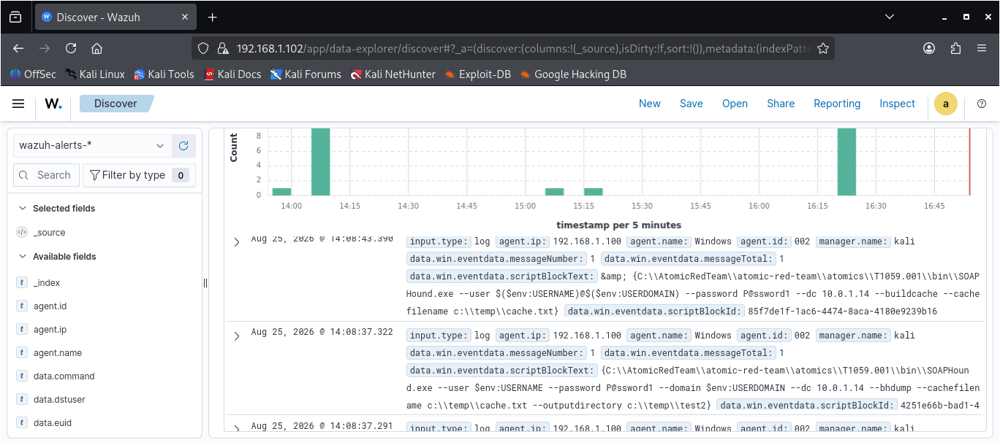
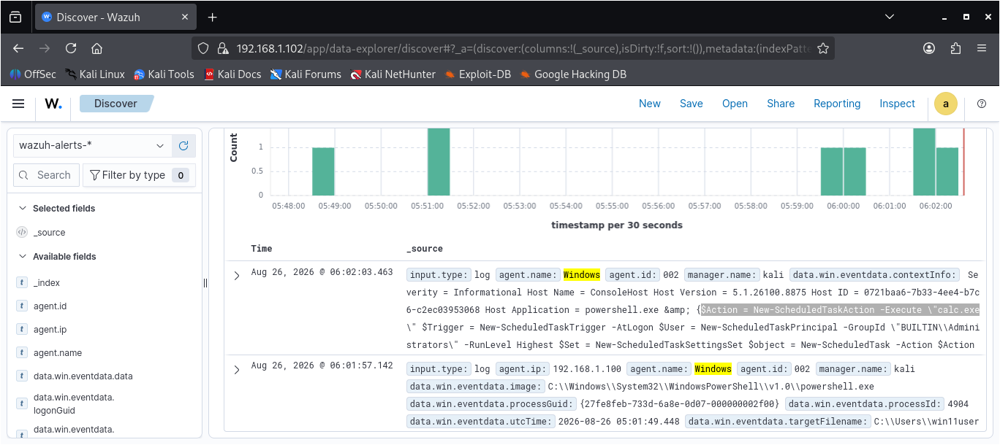
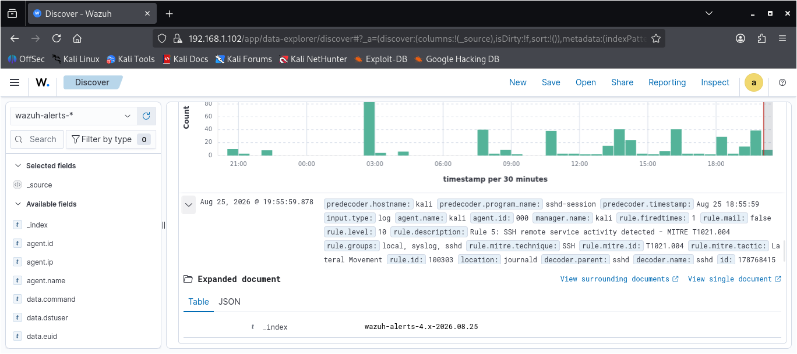
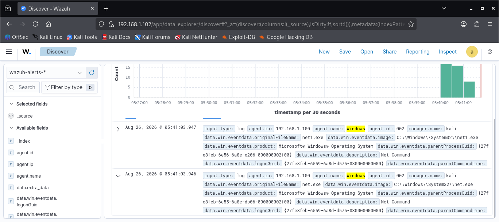
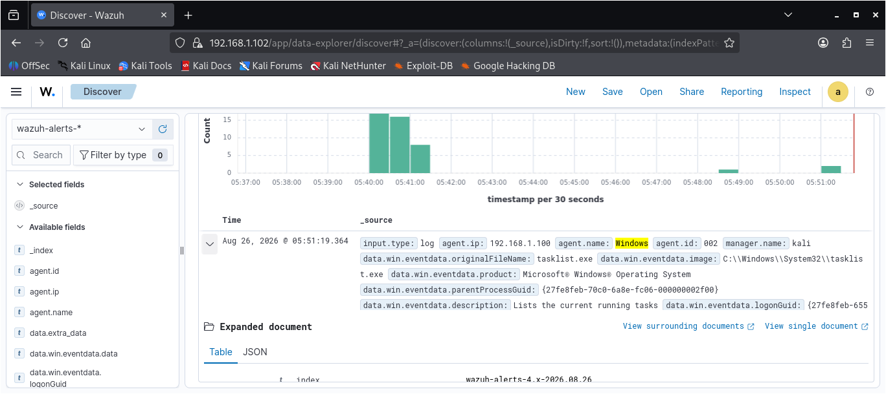

# OBJECTIVE

The objective of this project is to design, implement, test, and validate a practical SOC detection and response workflow using Wazuh, Windows, Sysmon, and Atomic Red Team.

The project focuses on developing custom Wazuh detection rules for selected adversary behaviors mapped to the MITRE ATT&CK framework. Atomic Red Team is used to safely simulate these behaviors and generate security events on the monitored Windows endpoint.

In addition to detection engineering, a security incident response playbook was developed and used to provide a structured process for handling detected activities. The playbook guides the workflow from alert identification and validation through investigation, analysis, documentation, and recommended response actions.

The project therefore demonstrates an end-to-end SOC workflow:

Attack Simulation → Log Generation → SIEM Collection → Detection → Alert Analysis → Investigation → Playbook Execution → Documentation → Rule Tuning & Validation

The overall goal is to demonstrate how security monitoring, detection engineering, alert investigation, and incident response procedures can work together to identify and respond to simulated adversary activity within a controlled SOC environment.

# SCOPE

This project covers the development and validation of a controlled SOC detection and response environment focused on endpoint monitoring, security event detection, investigation, and incident response.

The scope of the project includes:

- Configuring and monitoring a Windows endpoint using Wazuh and Sysmon.
- Developing custom Wazuh detection rules for selected adversary behaviors.
- Mapping detected behaviors to relevant MITRE ATT&CK techniques.
- Using Atomic Red Team to safely simulate adversary techniques and generate security telemetry.
- Collecting and analyzing Windows security, Sysmon, and PowerShell event logs.
- Testing detection rules to determine whether simulated activities generate the expected alerts.
- Troubleshooting and tuning detection rules where expected alerts were not generated.
- Developing and applying an incident response playbook to provide a structured response process for detected activities.
- Documenting investigation findings, detection gaps, and improvements made during the testing process.
- Validating the final detection workflow through controlled testing.

The project is limited to a controlled laboratory environment. All attack simulations are performed against intentionally configured test systems for educational and detection-engineering purposes.

# LAB ENVIRONMENT AND ARCHITECHTURE

The project was conducted in a controlled virtualized SOC laboratory environment designed to simulate the monitoring and detection capabilities of a small Security Operations Center.

The environment consisted of a Windows endpoint monitored by Wazuh and Sysmon, with Atomic Red Team used to generate controlled adversary activity. The Wazuh infrastructure collected and analyzed security telemetry generated during the simulations, allowing custom detection rules to be tested and validated.

Environment Components

Wazuh Manager

The Wazuh Manager served as the central security monitoring and detection component of the lab. It received security events from the monitored Windows endpoint, processed the collected telemetry, and generated alerts based on configured detection rules.

Windows Endpoint

A Windows 11 virtual machine was used as the monitored endpoint. The system served as the target for controlled attack simulations and generated the Windows security and system telemetry required for detection and investigation.

Sysmon

Sysmon was deployed on the Windows endpoint to provide detailed telemetry about system activity, including process creation and other endpoint events. These logs provided additional visibility for developing and testing custom detection rules.

Atomic Red Team

Atomic Red Team was used to simulate selected MITRE ATT&CK techniques in a controlled manner. The simulations generated realistic endpoint activity that could be observed through Windows logs, Sysmon, and Wazuh.

Detection Rules

Custom Wazuh rules were developed to identify specific behaviors associated with the simulated techniques. The rules were tested against generated telemetry and tuned when the expected alerts were not produced.

Incident Response Playbook

An incident response playbook was created as part of the project to provide a structured procedure for responding to detected security events. The playbook was actively used during the investigation and response workflow rather than being created only as documentation.

Detection Workflow

The overall laboratory workflow was:

Atomic Red Team → Windows Endpoint → Sysmon / Windows Event Logs → Wazuh Agent → Wazuh Manager → Custom Detection Rules → Alert → Investigation → Incident Response Playbook → Documentation & Response

This architecture allowed the project to demonstrate the complete process of generating controlled adversary activity, collecting security telemetry, detecting suspicious behavior, investigating alerts, and following a structured response procedure.

# TOOLS AND TECHNOLOGIES

The following tools and technologies were used throughout the project to build the detection, monitoring, simulation, investigation, and response workflow.

<table>
  <thead>
    <tr>
      <th width="20%">Tool / Technology</th>
      <th width="80%">Purpose</th>
    </tr>
  </thead>
  <tbody>
    <tr>
      <td><strong>Wazuh</strong></td>
      <td>SIEM and endpoint security monitoring platform used for log collection, alert generation, detection rules, and security event analysis.</td>
    </tr>
    <tr>
      <td><strong>Wazuh Agent</strong></td>

# TECHNIQUES INVESTIGATION

The project focused on five selected adversary techniques from the MITRE ATT&CK framework. These techniques were selected based on their relevance to endpoint security monitoring and their ability to generate observable security telemetry within the controlled laboratory environment.

Each technique was simulated using Atomic Red Team and monitored through Windows Event Logs, Sysmon, and Wazuh. Custom Wazuh detection rules were developed for the selected behaviors and subsequently tested through controlled attack simulations.

| MITRE ATT&CK Technique | Technique ID | Tactic | Detection Focus |
|---|---|---|---|
| PowerShell | T1059.001 | Execution | Detecting PowerShell execution and suspicious command activity. |
| Scheduled Task/Job: Scheduled Task | T1053.005 | Persistence | Detecting the creation and execution of scheduled tasks. |
| SSH | T1021.004 | Lateral Movement | Detecting the use of SSH for remote service access. |
| Account Discovery: Local Account | T1087.001 | Discovery | Detecting attempts to enumerate local user accounts. |
| Process Discovery | T1057 | Discovery | Detecting commands and processes used to enumerate running processes. |

All five techniques were successfully simulated and generated observable activity within the laboratory environment. The resulting telemetry was collected by Wazuh and used to validate the corresponding custom detection rules.

The testing process also provided an opportunity to evaluate detection accuracy, identify potential gaps, troubleshoot detection logic, and tune the rules where necessary. Following tuning and validation, the five detection scenarios successfully produced the expected security alerts.

# METHODOLOGY

The project followed a structured detection engineering and alert triage methodology designed to simulate adversary behavior, collect endpoint telemetry, develop detection logic, validate alerts, and perform incident response.

## 1. Environment Preparation

A controlled virtual SOC environment was established using VirtualBox. The Windows 11 endpoint was configured with the Wazuh Agent and Sysmon to provide centralized monitoring and detailed endpoint telemetry.

The Wazuh Manager was configured to receive and analyze security events generated by the monitored endpoint.

## 2. Technique Selection

Five MITRE ATT&CK techniques were selected based on their relevance to endpoint security monitoring and their ability to produce observable activity within the laboratory environment.

The selected techniques covered multiple adversary tactics, including Execution, Persistence, Lateral Movement, and Discovery.

## 3. Adversary Simulation

Atomic Red Team was used to simulate the selected MITRE ATT&CK techniques against the Windows endpoint.

Each simulation was performed in the controlled laboratory environment to generate realistic security events without affecting external systems.

## 4. Telemetry Collection

The simulated activities generated telemetry through Windows Event Logs and Sysmon. The Wazuh Agent collected the relevant events and forwarded them to the Wazuh Manager for analysis.

The collected telemetry was reviewed to identify the fields, event IDs, process information, command-line activity, and other indicators required to develop effective detection logic.

## 5. Detection Rule Development

Custom Wazuh detection rules were developed for the selected techniques.

The detection logic was designed to identify specific characteristics of the simulated behavior while reducing unnecessary alerts. MITRE ATT&CK technique mappings were incorporated into the detection rules to maintain alignment with the framework.

## 6. Detection Testing and Validation

Each custom detection rule was tested by executing the corresponding Atomic Red Team simulation.

The generated events and Wazuh alerts were reviewed to determine whether the expected behavior was successfully detected.

Where a rule did not initially trigger as expected, the rule logic and available telemetry were reviewed. Required adjustments were then made before the detection was tested again.

## 7. Alert Investigation and Triage

Generated alerts were investigated to determine what activity triggered the detection, which endpoint was involved, what process or command was executed, and whether the behavior corresponded to the simulated MITRE ATT&CK technique.

The investigation process was used to distinguish expected laboratory activity from potentially suspicious behavior and to determine the appropriate response.

## 8. Incident Response

An incident response playbook was developed and used during the project to provide a structured approach to handling detected activity.

The playbook guided the response process from alert validation and investigation through documentation and recommended response actions.

## 9. Documentation

Evidence from the simulations, detection testing, investigations, and response activities was documented throughout the project.

Screenshots and other relevant evidence were retained to demonstrate the configuration, attack simulations, generated telemetry, detection alerts, rule validation, and incident response workflow.

## Overall Methodology

The project followed the workflow:

*Technique Selection → Attack Simulation → Telemetry Collection → Detection Rule Development → Detection Testing → Alert Generation → Investigation & Triage → Incident Response Playbook → Validation → Documentation*

# DETECTION ENGINEERING

The detection engineering phase focused on developing custom Wazuh rules to identify the five selected MITRE ATT&CK techniques simulated within the laboratory environment.

The detection rules were developed based on the telemetry generated by the Windows endpoint during controlled Atomic Red Team simulations. Event fields, process information, command-line activity, authentication events, and other relevant indicators were analyzed to determine the conditions required for each detection.

Each rule was subsequently tested against its corresponding simulated technique to validate whether Wazuh generated the expected alert.

## Detection Engineering Process

The following process was applied to each detection:

1. Identify the MITRE ATT&CK technique and expected adversary behavior.
2. Execute the corresponding Atomic Red Team simulation.
3. Review the resulting Windows and Sysmon telemetry.
4. Identify the relevant event IDs and log fields.
5. Develop a custom Wazuh detection rule.
6. Map the rule to the appropriate MITRE ATT&CK technique.
7. Test the rule against the simulated activity.
8. Review the generated Wazuh alert.
9. Troubleshoot and tune the rule where necessary.
10. Re-run the simulation to validate the final detection.

## Detection Coverage

The project developed custom detections covering the following techniques:

| Detection | MITRE ATT&CK ID | Tactic |
|---|---|---|
| PowerShell Execution | T1059.001 | Execution |
| Scheduled Task Creation | T1053.005 | Persistence |
| SSH | T1021.004 | Lateral Movement |
| Local Account Discovery | T1087.001 | Discovery |
| Process Discovery | T1057 | Discovery |

The detection engineering process demonstrated how raw endpoint telemetry can be transformed into actionable security alerts through carefully designed detection logic.

The resulting detections were tested using controlled adversary simulations, allowing their effectiveness to be evaluated before being incorporated into the broader investigation and incident response workflow.

# DETECTION 1: POWERSHELL EXECUTION 

## MITRE ATT&CK Mapping

- *Technique:* PowerShell
- *Technique ID:* T1059.001
- *Tactic:* Execution

## Objective

The objective of this detection was to identify PowerShell execution on the Windows endpoint and generate a Wazuh alert when PowerShell was used.

PowerShell is a legitimate Windows administration tool, but it can also be abused by adversaries to execute commands, download payloads, perform reconnaissance, and carry out other malicious activities. The detection was therefore designed to provide visibility into PowerShell execution while demonstrating how endpoint telemetry can be used to identify potentially suspicious activity.

## Attack Simulation

Atomic Red Team was used to simulate the PowerShell technique (T1059.001) on the Windows 11 endpoint.

A controlled PowerShell command was executed to generate observable endpoint activity. The simulation produced PowerShell-related Windows event telemetry, including PowerShell operational events.

The generated telemetry was forwarded by the Wazuh Agent to the Wazuh Manager for analysis.

## Telemetry Analysis

During the investigation of the generated events, PowerShell activity was observed within the Windows PowerShell Operational event channel.

Relevant telemetry included PowerShell execution information and script block logging, including Event IDs 4103 and 4104.

The collected telemetry was analyzed to identify reliable fields that could be used as conditions within the custom Wazuh detection rule.

## Detection Logic

The detection rule was designed to identify PowerShell execution based on the endpoint telemetry received by Wazuh.

The rule used the relevant Wazuh parent rule and checked the Windows event data associated with the executed image to identify PowerShell activity.

The detection was mapped to MITRE ATT&CK technique T1059.001.

## Detection Rule

The custom Wazuh rule was configured to generate a high-severity alert when the defined PowerShell execution condition was observed.

The rule was assigned a custom rule ID and included MITRE ATT&CK metadata to associate the alert with T1059.001.

The final rule was tested within the Wazuh environment to confirm that it loaded correctly and could process the expected telemetry.

## Detection Testing

The detection was tested by executing the controlled Atomic Red Team PowerShell simulation again after the rule was configured.

The resulting Windows telemetry was received by Wazuh and evaluated against the custom detection logic.

The test confirmed that PowerShell activity could be identified and generated the expected Wazuh alert.

## Result

The PowerShell detection was successfully validated.

The test demonstrated the complete detection workflow:

*Atomic Red Team Simulation → PowerShell Execution → Windows Telemetry → Wazuh Agent → Wazuh Manager → Custom Detection Rule → Wazuh Alert*

The detection provided visibility into PowerShell execution and demonstrated the ability to convert endpoint telemetry into a security alert mapped to MITRE ATT&CK.

## Evidence

The following screenshot shows the Wazuh alert generated after successfully testing the PowerShell detection rule against the controlled Atomic Red Team simulation.

# DETECTION 2: SCHEDULED TASK/JOB — SCHEDULED TASK

## MITRE ATT&CK MAPPING

- *Technique:* Scheduled Task/Job: Scheduled Task
- *Technique ID:* T1053.005
- *Tactic:* Persistence

## OBJECTIVE

The objective of this detection was to identify the creation of scheduled tasks on the Windows endpoint and generate a Wazuh alert when a scheduled task was created.

Scheduled tasks are legitimate Windows functionality commonly used for automation and administrative purposes. However, adversaries can abuse scheduled tasks to establish persistence and execute malicious programs at specific times or system events. The detection was therefore designed to provide visibility into scheduled task activity and identify behavior associated with the MITRE ATT&CK T1053.005 technique.

## ATTACK SIMULATION

Atomic Red Team was used to simulate the Scheduled Task technique (T1053.005) on the Windows 11 endpoint.

A controlled scheduled task creation activity was executed to generate observable endpoint telemetry. The resulting Windows events were collected by the Wazuh Agent and forwarded to the Wazuh Manager for analysis.

## TELEMETRY ANALYSIS

The generated Windows telemetry was analyzed to identify the events and fields associated with scheduled task creation.

The collected events provided information about the scheduled task activity, including the action performed and other relevant event data that could be used to construct the detection logic.

The telemetry was reviewed to determine reliable conditions that could distinguish scheduled task creation from unrelated Windows activity.

## DETECTION LOGIC

The detection rule was designed to identify scheduled task creation based on the Windows endpoint telemetry received by Wazuh.

The rule was configured to match the relevant event information associated with scheduled task activity and was mapped to MITRE ATT&CK technique T1053.005.

The detection logic was tested against the generated telemetry to confirm that the rule could identify the simulated behavior.

## DETECTION RULE

A custom Wazuh rule was created to generate a security alert when the defined scheduled task creation conditions were observed.

The rule included MITRE ATT&CK metadata linking the detection to T1053.005 and was assigned an appropriate severity level for the simulated behavior.

The rule was tested within the Wazuh environment to verify that it loaded correctly and could process the expected endpoint telemetry.

## DETECTION TESTING

The detection was tested by executing the controlled Atomic Red Team Scheduled Task simulation after the custom rule had been configured.

The resulting Windows events were collected by the Wazuh Agent and processed by the Wazuh Manager.

The test successfully generated the expected Wazuh alert, confirming that the custom detection rule was able to identify the simulated scheduled task activity.

## RESULT

The Scheduled Task detection was successfully validated.

The test demonstrated the complete detection workflow:

*Atomic Red Team Simulation → Scheduled Task Creation → Windows Telemetry → Wazuh Agent → Wazuh Manager → Custom Detection Rule → Wazuh Alert*

The detection provided visibility into scheduled task activity and demonstrated the ability to identify behavior associated with persistence through scheduled tasks.

## EVIDENCE

The following screenshot shows the Wazuh alert generated after successfully testing the Scheduled Task detection rule against the controlled Atomic Red Team simulation.

# DETECTION 3: SSH

## MITRE ATT&CK MAPPING

- *Technique:* Remote Services: SSH
- *Technique ID:* T1021.004
- *Tactic:* Lateral Movement

## OBJECTIVE

The objective of this detection was to identify SSH activity on the Windows endpoint and generate a Wazuh alert when SSH was used for remote service access.

SSH is a legitimate remote administration protocol, but adversaries can abuse it to access systems remotely and move laterally within an environment. The detection was therefore designed to provide visibility into SSH activity and identify behavior associated with the MITRE ATT&CK T1021.004 technique.

## ATTACK SIMULATION

Atomic Red Team was used to simulate the SSH technique (T1021.004) within the controlled laboratory environment.

A controlled SSH activity was executed to generate observable endpoint telemetry. The resulting events were collected by the Wazuh Agent and forwarded to the Wazuh Manager for analysis.

## TELEMETRY ANALYSIS

The telemetry generated during the simulation was reviewed to identify the relevant endpoint events and fields associated with SSH activity.

The collected information was analyzed to determine the characteristics that could reliably be used by the Wazuh detection rule.

## DETECTION LOGIC

The detection rule was designed to identify SSH-related activity from the telemetry received by Wazuh.

The rule was configured to match the relevant event information associated with SSH activity and mapped to MITRE ATT&CK technique T1021.004.

## DETECTION RULE

A custom Wazuh rule was created to generate an alert when the defined SSH activity conditions were observed.

The rule included MITRE ATT&CK metadata linking the detection to T1021.004 and was assigned an appropriate severity level.

The rule was tested within the Wazuh environment to confirm that it loaded correctly and processed the expected telemetry.

## DETECTION TESTING

The detection was tested by executing the controlled Atomic Red Team SSH simulation after the custom rule had been configured.

The resulting telemetry was collected by the Wazuh Agent and processed by the Wazuh Manager.

The test successfully generated the expected Wazuh alert, confirming that the detection rule was able to identify the simulated SSH activity.

## RESULT

The SSH detection was successfully validated.

The test demonstrated the complete detection workflow:

*Atomic Red Team Simulation → SSH Activity → Endpoint Telemetry → Wazuh Agent → Wazuh Manager → Custom Detection Rule → Wazuh Alert*

The detection provided visibility into remote service activity associated with SSH and demonstrated the ability to detect behavior relevant to lateral movement.

## EVIDENCE

The following screenshot shows the Wazuh alert generated after successfully testing the SSH detection rule against the controlled Atomic Red Team simulation.

# DETECTION 4: ACCOUNT DISCOVERY — LOCAL ACCOUNT

## MITRE ATT&CK MAPPING

- *Technique:* Account Discovery: Local Account
- *Technique ID:* T1087.001
- *Tactic:* Discovery

## OBJECTIVE

The objective of this detection was to identify attempts to enumerate local user accounts on the Windows endpoint and generate a Wazuh alert when local account discovery activity occurred.

Adversaries may enumerate local accounts to identify available users, privileged accounts, and potential targets for further activity. The detection was therefore designed to provide visibility into local account discovery behavior and identify activity associated with MITRE ATT&CK T1087.001.

## ATTACK SIMULATION

Atomic Red Team was used to simulate the Local Account Discovery technique (T1087.001) on the Windows 11 endpoint.

A controlled account enumeration activity was executed to generate observable endpoint telemetry.

The resulting events were collected by the Wazuh Agent and forwarded to the Wazuh Manager for analysis.

## TELEMETRY ANALYSIS

The telemetry generated during the simulation was reviewed to identify the relevant Windows events and fields associated with local account enumeration.

The available process and command-line information was analyzed to determine the characteristics that could be used to identify the simulated discovery behavior.

## DETECTION LOGIC

The detection rule was designed to identify local account discovery activity based on the endpoint telemetry received by Wazuh.

The rule was configured to match the relevant process or command-line characteristics associated with local account enumeration and mapped to MITRE ATT&CK technique T1087.001.

## DETECTION RULE

A custom Wazuh rule was created to generate a security alert when the defined local account discovery conditions were observed.

The rule included MITRE ATT&CK metadata linking the detection to T1087.001 and was assigned an appropriate severity level.

The rule was tested within the Wazuh environment to verify that it loaded correctly and processed the expected endpoint telemetry.

## DETECTION TESTING

The detection was tested by executing the controlled Atomic Red Team Local Account Discovery simulation after the custom rule had been configured.

The resulting endpoint telemetry was collected by the Wazuh Agent and evaluated by the Wazuh Manager.

The test successfully generated the expected Wazuh alert, confirming that the custom detection rule could identify the simulated local account discovery activity.

## RESULT

The Local Account Discovery detection was successfully validated.

The test demonstrated the complete detection workflow:

*Atomic Red Team Simulation → Local Account Discovery → Endpoint Telemetry → Wazuh Agent → Wazuh Manager → Custom Detection Rule → Wazuh Alert*

The detection provided visibility into account enumeration activity and demonstrated the ability to identify behavior associated with the Discovery tactic.

## EVIDENCE

The following screenshot shows the Wazuh alert generated after successfully testing the Local Account Discovery detection rule against the controlled Atomic Red Team simulation.

# DETECTION 5: PROCESS DISCOVERY

## MITRE ATT&CK MAPPING

- *Technique:* Process Discovery
- *Technique ID:* T1057
- *Tactic:* Discovery

## OBJECTIVE

The objective of this detection was to identify process discovery activity on the Windows endpoint and generate a Wazuh alert when commands or processes were used to enumerate running processes.

Adversaries may perform process discovery to understand what applications and services are running on a compromised system. This information can help identify security software, valuable applications, and processes that may be targeted during later stages of an attack.

The detection was therefore designed to provide visibility into process discovery behavior and identify activity associated with MITRE ATT&CK technique T1057.

## ATTACK SIMULATION

Atomic Red Team was used to simulate the Process Discovery technique (T1057) on the Windows 11 endpoint.

A controlled process enumeration activity was executed to generate observable endpoint telemetry.

The resulting events were collected by the Wazuh Agent and forwarded to the Wazuh Manager for analysis.

## TELEMETRY ANALYSIS

The telemetry generated during the simulation was reviewed to identify the relevant Windows and Sysmon events associated with process discovery.

Process execution and command-line information were analyzed to determine the characteristics that could reliably identify the simulated discovery behavior.

The collected telemetry was used to identify the appropriate fields and conditions required for the custom Wazuh detection rule.

## DETECTION LOGIC

The detection rule was designed to identify process discovery activity based on the endpoint telemetry received by Wazuh.

The rule was configured to match the relevant process and command-line characteristics associated with process enumeration and mapped to MITRE ATT&CK technique T1057.

## DETECTION RULE

A custom Wazuh rule was created to generate a security alert when the defined process discovery conditions were observed.

The rule included MITRE ATT&CK metadata linking the detection to T1057 and was assigned an appropriate severity level.

The rule was tested within the Wazuh environment to verify that it loaded correctly and could process the expected endpoint telemetry.

## DETECTION TESTING

The initial detection test was performed by executing the controlled Atomic Red Team Process Discovery simulation after the custom rule had been configured.

The resulting endpoint telemetry was collected by the Wazuh Agent and evaluated by the Wazuh Manager.

During the initial test, the expected Wazuh alert was not generated.

This indicated that the detection logic required further investigation and tuning before the rule could reliably identify the simulated Process Discovery activity.

## DETECTION TUNING

The detection rule was reviewed against the telemetry generated during the initial Atomic Red Team simulation.

The relevant event fields and command-line information were examined to determine why the rule was not matching the expected activity.

The detection logic was then tuned to improve its matching conditions and correctly identify the Process Discovery behavior within the collected endpoint telemetry.

After the tuning was completed, the same controlled Atomic Red Team Process Discovery simulation was executed again.

The updated rule successfully generated the expected Wazuh alert during the second test.

This confirmed that the tuning corrected the detection logic and improved the rule's ability to identify the intended Process Discovery behavior.

## RESULT

The Process Discovery detection was successfully validated after tuning.

The testing demonstrated an important part of the detection engineering process: a detection rule may not work correctly during its initial implementation and may require analysis of real telemetry, troubleshooting, and refinement before it can reliably identify the intended behavior.

The final detection successfully demonstrated the complete workflow:

*Atomic Red Team Simulation → Process Discovery → Endpoint Telemetry → Wazuh Agent → Wazuh Manager → Tuned Detection Rule → Wazuh Alert*

The detection provided visibility into process enumeration activity and demonstrated the ability to identify behavior associated with the Discovery tactic.

## EVIDENCE

The following screenshot shows the Wazuh alert generated after the Process Discovery detection rule was tuned and successfully tested against the controlled Atomic Red Team simulation.

# ALERT TRIAGE AND INVESTIGATION

Following the successful validation of the custom detection rules, the generated Wazuh alerts were reviewed and investigated to determine the activity responsible for each alert.

The alert triage process focused on understanding the detected behavior, validating the associated telemetry, identifying the affected endpoint, and determining whether the alert corresponded to the controlled activity that had been simulated.

## Triage Process

The following process was used when reviewing the generated alerts:

1. Review the Wazuh alert and identify the detection rule that generated it.
2. Identify the MITRE ATT&CK technique associated with the alert.
3. Examine the timestamp and source information associated with the event.
4. Review the available Windows and Sysmon telemetry.
5. Examine process, command-line, authentication, or other relevant event information.
6. Determine whether the detected activity matched the Atomic Red Team simulation.
7. Validate that the alert represented the expected behavior.
8. Determine the appropriate investigation and response actions using the incident response playbook.

## Alert Analysis

The Wazuh alerts provided security-relevant information that could be used to understand the activity behind each detection.

The investigation included reviewing event details and endpoint telemetry to establish what occurred and why the detection was triggered.

This process demonstrated the difference between simply generating an alert and actually investigating the activity represented by that alert.

## Detection Validation

Because the simulations were intentionally executed within the controlled laboratory environment, the alerts could be correlated with the corresponding Atomic Red Team tests.

This allowed each detection to be validated against known activity and provided a controlled method for determining whether the custom detection rules were identifying the intended behaviors.

## Investigation Outcome

The alert triage process confirmed that the successfully generated alerts corresponded to the simulated MITRE ATT&CK techniques.

The investigation also demonstrated the importance of examining the underlying telemetry rather than relying solely on the alert title or severity level.

The validated alerts were then handled using the incident response playbook developed for the project.

# INCIDENT RESPONSE PLAYBOOK

An incident response playbook was developed as part of the project to provide a structured and repeatable process for responding to security alerts generated by the detection rules.

The playbook was not created solely as documentation. It was actively used during the alert investigation and response workflow to guide the handling of detected activity.

## Purpose of the Playbook

The purpose of the playbook was to provide a consistent procedure for moving from an initial security alert through validation, investigation, response, and documentation.

It helped ensure that alerts were handled systematically rather than investigated in an ad-hoc manner.

## Playbook Workflow

The incident response process followed these stages:

*Alert Detection → Alert Validation → Initial Investigation → Scope Assessment → Containment → Evidence Collection → Response Actions → Recovery → Documentation*

## Alert Detection

The process began when a custom Wazuh detection rule generated an alert based on activity observed on the monitored Windows endpoint.

The alert was reviewed to identify the detection rule, associated MITRE ATT&CK technique, severity, timestamp, and available event information.

## Alert Validation

The alert was validated by comparing the Wazuh telemetry with the controlled Atomic Red Team activity that generated the event.

This step helped determine whether the alert represented the expected simulated behavior and ensured that the detection was functioning as intended.

## Investigation

The relevant endpoint telemetry was examined to understand the activity responsible for the alert.

The investigation included reviewing available event information, process activity, command-line data, authentication information, and other relevant security telemetry depending on the technique being investigated.

## Scope Assessment

The affected endpoint and associated activity were reviewed to determine the scope of the detected behavior.

Because the testing was conducted within a controlled laboratory environment, the investigation could be correlated directly with the corresponding Atomic Red Team simulation.

## Containment and Response

Appropriate response actions were considered based on the nature of the detected activity.

The playbook provided guidance for containing suspicious activity and preventing further impact where necessary within the laboratory environment.

## Evidence Collection

Relevant alert information and supporting telemetry were reviewed and documented as part of the investigation.

The evidence was used to support the determination of what activity occurred, which detection identified it, and how the alert was handled.

## Documentation

The investigation and response process was documented to maintain a record of the detection, analysis, actions taken, and final outcome.

This documentation also provided a basis for evaluating the effectiveness of the detection rule and identifying areas where further tuning or improvement could be required.

## Playbook Application

The incident response playbook was applied during the project to guide the investigation and handling of the alerts generated from the controlled attack simulations.

Using the playbook demonstrated how detection engineering can be connected to the broader SOC workflow, moving from *detection to triage, investigation, and response* rather than treating alert generation as the final objective.

## Outcome

The use of the incident response playbook provided a structured approach for handling the alerts generated during the detection testing phase.

It demonstrated the integration of custom detection rules, alert triage, investigation, and incident response within a single SOC workflow.

# FINDINGS AND RESULTS

The project successfully demonstrated an end-to-end SOC detection and response workflow using a controlled Windows environment monitored by Wazuh.

Five MITRE ATT&CK techniques were simulated using Atomic Red Team, with the resulting endpoint activity collected and analyzed through Windows Event Logs, Sysmon, and the Wazuh platform.

## Detection Results

All five custom detection rules were successfully tested against their corresponding simulated adversary behaviors.

| Detection | MITRE ATT&CK ID | Tactic | Result |
|---|---|---|---|
| PowerShell Execution | T1059.001 | Execution | Successfully detected and validated. |
| Scheduled Task/Job: Scheduled Task | T1053.005 | Persistence | Successfully detected and validated. |
| SSH | T1021.004 | Lateral Movement | Successfully detected and validated. |
| Account Discovery: Local Account | T1087.001 | Discovery | Successfully detected and validated. |
| Process Discovery | T1057 | Discovery | Successfully detected after detection tuning. |

## Detection Tuning Finding

During the Process Discovery testing, the initial detection rule did not generate the expected Wazuh alert.

The generated telemetry was reviewed to identify the reason for the failed detection. The detection logic was subsequently tuned to improve its matching conditions.

The Process Discovery simulation was executed again after the rule was modified, and the updated rule successfully generated the expected Wazuh alert.

This demonstrated that effective detection engineering requires iterative testing, telemetry analysis, troubleshooting, and rule refinement.

## Key Findings

The project produced the following key findings:

- Wazuh successfully collected and analyzed security telemetry from the monitored Windows endpoint.
- Sysmon provided additional endpoint visibility that supported the development and validation of detection logic.
- Atomic Red Team provided a controlled method for generating adversary-like activity for detection testing.
- Custom Wazuh rules successfully identified the five selected MITRE ATT&CK techniques.
- Detection rules required validation against actual telemetry rather than relying solely on expected event structures.
- Detection tuning was necessary when the initial Process Discovery rule failed to trigger.
- The incident response playbook provided a structured process for handling and investigating generated alerts.
- The project demonstrated the connection between adversary simulation, telemetry collection, detection engineering, alert triage, investigation, and incident response.

## Overall Result

The project successfully demonstrated the ability to build, test, troubleshoot, and validate custom SOC detections within a controlled laboratory environment.

The completed workflow showed how simulated adversary behavior can be transformed into actionable security alerts and subsequently investigated using a structured SOC process.

*Overall Workflow:*

*Adversary Simulation → Telemetry Collection → Detection Engineering → Alert Generation → Alert Triage → Investigation → Incident Response → Documentation*

# CHALLENGES AND LIMITATIONS

During the development and testing of the SOC detection environment, several technical challenges were encountered. These challenges provided opportunities to troubleshoot the environment, analyze telemetry, and improve the detection logic.

## Detection Rule Failures

One of the main challenges encountered was that some detection rules did not immediately generate the expected alerts during initial testing.

The Process Discovery detection, in particular, required additional troubleshooting and tuning after the initial test failed to trigger the expected alert.

The underlying telemetry was reviewed, the detection conditions were refined, and the rule was tested again until the expected alert was successfully generated.

## Telemetry and Event Analysis

Another challenge involved identifying the most appropriate telemetry fields for reliable detection.

Windows and Sysmon generate a large volume of events, and not every event contains the information required by a specific detection rule. This required reviewing the available event data and identifying fields that could provide reliable detection conditions.

## High Volume of PowerShell Telemetry

The PowerShell testing generated a significant amount of PowerShell-related telemetry, including Script Block Logging events.

This demonstrated that legitimate administrative activity and simulated adversary activity can produce large volumes of similar telemetry, highlighting the importance of developing detection logic that focuses on meaningful indicators rather than generating excessive alerts.

## Rule Configuration and Validation

Custom Wazuh rules required careful configuration and validation before they could be considered reliable.

Incorrect conditions, unsupported fields, or mismatched event structures could prevent a rule from loading correctly or cause it to miss the intended activity.

The testing process therefore included repeated validation of the rule configuration and comparison against the actual telemetry being generated.

## Laboratory Environment Limitations

The project was conducted within a controlled virtual laboratory environment. As a result, the activity simulated during testing does not represent the full complexity or scale of a production SOC environment.

The environment was primarily designed to demonstrate detection engineering, alert triage, investigation, and incident response concepts rather than provide complete enterprise-level monitoring coverage.

## Scope of Detection Coverage

Only five MITRE ATT&CK techniques were selected for this project.

Although the selected techniques covered multiple tactics, they represent only a small portion of the behaviors that a production SOC would need to monitor.

Additional detections, log sources, endpoints, and network telemetry would be required to provide broader security coverage.

## Key Lesson

The challenges encountered during the project reinforced the importance of continuous detection testing and improvement.

A detection rule should not be considered effective simply because it has been written. It must be tested against realistic telemetry, investigated when it fails, tuned where necessary, and validated again to confirm that it produces the intended result.

# RECOMMENDATIONS AND FUTURE IMPROVEMENTS

Although the project successfully demonstrated custom detection engineering, alert triage, investigation, and incident response within a controlled laboratory environment, several improvements could be made to increase detection coverage and move the environment closer to a production SOC.

## Expand MITRE ATT&CK Coverage

Additional MITRE ATT&CK techniques should be implemented to increase the breadth of detection coverage.

Future work could include techniques from additional tactics such as Credential Access, Defense Evasion, Command and Control, Exfiltration, and Impact.

## Increase Log Source Coverage

Additional security telemetry should be integrated into the SOC environment.

Potential sources include:

- Firewall logs
- Network intrusion detection logs
- DNS logs
- Authentication logs
- Web server logs
- Additional Windows security events
- Network traffic captures

Expanding the available telemetry would provide greater visibility across both endpoint and network activity.

## Improve Detection Correlation

Future detections could use multiple related events rather than relying on a single event condition.

Correlation-based detections could help identify attack chains by connecting multiple activities occurring on the same endpoint or involving the same user, process, or source.

## Reduce False Positives

Detection rules should continue to be tuned to distinguish legitimate administrative activity from potentially malicious behavior.

This is particularly important for commonly abused legitimate tools such as PowerShell, which can generate a large volume of normal administrative telemetry.

## Expand Automated Response

Future development could introduce automated response actions for selected high-confidence alerts.

For example, appropriately validated detections could trigger actions such as isolating an endpoint, disabling a compromised account, or blocking a known malicious indicator.

Automated response should be implemented carefully to avoid disrupting legitimate activity.

## Improve Incident Response Documentation

The incident response playbook can be expanded to include more detailed procedures for different alert categories.

Separate response procedures could be developed for credential attacks, persistence mechanisms, lateral movement, malware execution, and other common SOC scenarios.

## Continuous Detection Testing

Detection rules should be tested periodically to ensure that they continue to function as expected after changes to the endpoint, Wazuh configuration, operating system, or detection logic.

Regular adversary simulation using frameworks such as Atomic Red Team can provide a repeatable method for validating detection coverage.

## Future Development

The laboratory can be further expanded by introducing additional endpoints, network devices, security controls, and centralized log sources.

This would allow the environment to evolve from a basic endpoint-focused detection lab into a more comprehensive SOC simulation capable of demonstrating broader monitoring, detection, investigation, and response capabilities.

# CONCLUSION

This project demonstrated the practical implementation of a Security Operations Center detection and response workflow within a controlled laboratory environment.

The project combined Wazuh, Windows 11, Sysmon, and Atomic Red Team to simulate adversary behavior, collect endpoint telemetry, develop custom detection rules, and validate security alerts against selected MITRE ATT&CK techniques.

Five techniques were successfully tested across multiple adversary tactics: PowerShell (T1059.001), Scheduled Task/Job: Scheduled Task (T1053.005), SSH (T1021.004), Account Discovery: Local Account (T1087.001), and Process Discovery (T1057).

The project also demonstrated that detection engineering is an iterative process. The Process Discovery detection initially failed to generate the expected alert and required telemetry analysis and rule tuning before it successfully detected the simulated activity.

Beyond alert generation, the project incorporated alert triage, investigation, and an incident response playbook. This demonstrated how a SOC analyst can move from identifying suspicious activity to validating, investigating, and responding to an alert using a structured workflow.

Overall, the project provided practical experience in endpoint monitoring, MITRE ATT&CK-based detection engineering, security telemetry analysis, Wazuh rule development, alert triage, detection tuning, and incident response.

The completed laboratory demonstrates the following end-to-end SOC workflow:

*Adversary Simulation → Telemetry Collection → Detection Engineering → Alert Generation → Alert Triage → Investigation → Incident Response → Documentation*

The project establishes a foundation that can be expanded with additional detection rules, log sources, endpoints, network monitoring, automated response capabilities, and broader MITRE ATT&CK coverage.

## REPORT DOCUMENTATION

The complete project report is available below:

[View the Project Report](docs/Detection-Engineering-and-Alert-Triage-Report.pdf)
