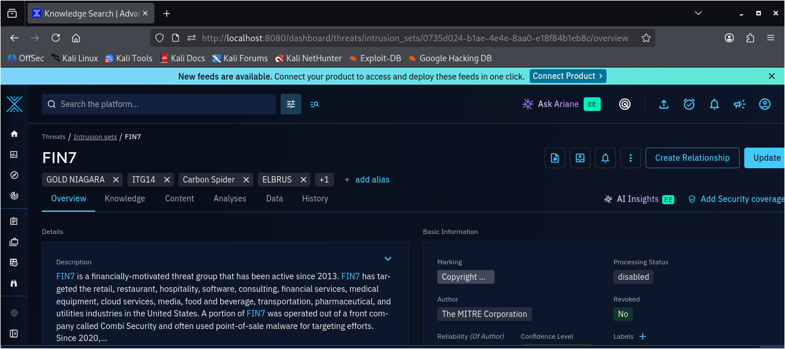
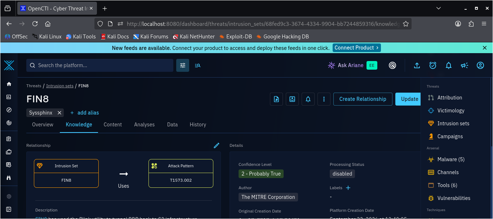
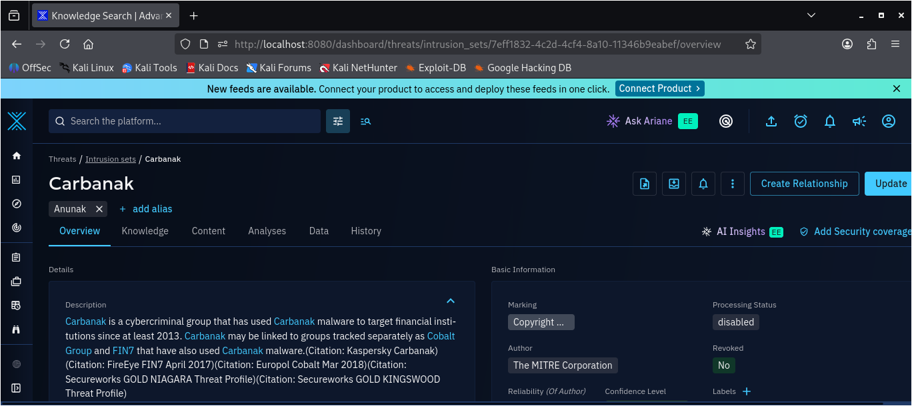

## Overview

As part of my OpenCTI implementation, I explored a use case beyond enriching Wazuh security logs with threat intelligence. The goal was to demonstrate how OpenCTI could also be used as a dedicated **threat intelligence platform** for collecting, organizing, correlating, and analyzing information about cyber threats.

As part of the **CyBlack Virtual Internship**, I selected **Flutterwave** as a case study and used OpenCTI to research its threat landscape within the financial services and digital payments sector.

Using OpenCTI's threat intelligence capabilities, including its **knowledge model and platform integrations**, I gathered and organized publicly available information from the internet about relevant threat actors, malware, attack techniques, targeting patterns, and a documented security incident associated with the organization and its sector.

The research focused on understanding the threats relevant to Flutterwave and representing key intelligence within OpenCTI, particularly **FIN7, FIN8, and Carbanak**, along with their associated techniques, malware, and tools.

## Objective

The objective of this project was to demonstrate a practical threat intelligence use case for OpenCTI by researching publicly available information related to Flutterwave and its financial services sector.

The project focused on using OpenCTI to:

- Gather and organize relevant threat intelligence from publicly available sources.
- Identify threat actors and groups relevant to the financial services sector.
- Analyze associated malware, tools, and MITRE ATT&CK techniques.
- Understand common targeting patterns and initial access methods.
- Represent and correlate the collected intelligence within OpenCTI.
- Develop a clearer understanding of the threat landscape affecting a financial technology and digital payments organization.

## Key Statistics / Findings

The research produced the following key findings:

- **3 threat actors** were examined: **FIN7, FIN8, and Carbanak**.
- **10+ MITRE ATT&CK techniques** were identified across the threat actors researched.
- **Multiple malware families and tools** associated with financially motivated threat activity were identified.
- Key attack patterns included **phishing, credential abuse, remote access, malware deployment, data exfiltration, and ransomware activity**.
- **1 documented Flutterwave security incident from 2024** was reviewed as a company-specific example of unauthorized activity.
- The research also identified broader financial-sector threats including **phishing, ransomware, Business Email Compromise (BEC), DDoS, data breaches, and social engineering**.
- OpenCTI was used to represent the researched threat actors and their associated intelligence, with dedicated profiles created/reviewed for **FIN7, FIN8, and Carbanak**.

## What I Found

### FIN7

**FIN7** was identified as a financially motivated threat group active since at least 2013. The group has targeted multiple industries, including financial services, and has historically used point-of-sale malware before later shifting toward ransomware operations.

The OpenCTI representation showed FIN7 as an **Intrusion Set** with a confidence level of **2 – Probably True** and an active date of **2013**.

Relevant techniques identified for FIN7 included:

- **T1566.001** — Phishing: Spearphishing Attachment
- **T1210** — Exploitation of Remote Services
- **T1113** — Screen Capture
- **T1587.001** — Develop Capabilities: Malware
- **T1567.002** — Exfiltration to Cloud Storage
- **T1558.003** — Kerberoasting

Associated malware identified included **BOOSTWRITE, SystemBC, and TEXTMATE**.

Associated tools included **Mimikatz, PowerSploit, and CrackMapExec**, used for activities such as credential dumping, PowerShell-based operations, post-exploitation, Active Directory reconnaissance, and lateral movement.

### FIN8

**FIN8** was identified as a financially motivated threat group active since at least 2016. The group has targeted sectors including hospitality, retail, entertainment, insurance, technology, chemical, and financial services.

The OpenCTI representation showed FIN8 as an **Intrusion Set** with a confidence level of **2 – Probably True** and an active date of **January 2016**.

Relevant techniques identified included:

- **T1047** — Windows Management Instrumentation
- **T1016.001** — System Network Configuration Discovery: Internet Connection Discovery
- **T1134.001** — Access Token Manipulation: Token Impersonation/Theft
- **T1112** — Modify Registry
- **T1486** — Data Encrypted for Impact
- **T1482** — Domain Trust Discovery
- **T1573.002** — Encrypted Channel: Asymmetric Cryptography

Associated malware included **BADHATCH, Sardonic, Ragnar Locker, PUNCHTRACK, and PUNCHBUGGY**.

Associated tools included **PsExec, Impacket, Ping, Nltest, Net, and dsquery**, supporting activities such as remote execution, lateral movement, network discovery, domain trust discovery, and Active Directory enumeration.

### Carbanak

**Carbanak** was identified as a cybercriminal group associated with attacks against financial institutions and active since at least 2013. It is also associated with the **Carbanak malware**, which provides remote access and supports activities such as espionage and data exfiltration.

The OpenCTI representation showed Carbanak as an **Intrusion Set**, also known by the alias **Anunak**, with a confidence level of **2 – Probably True**.

The research also showed that Carbanak is tracked separately from FIN7 in OpenCTI despite their shared use of the Carbanak malware and overlapping tooling.

Relevant techniques identified included:

- **T1588.002** — Obtain Capabilities: Tool
- **T1686** — Firewall Rule Modification
- **T1543.003** — Create or Modify System Process: Windows Service
- **T1036.005** — Masquerading: Match Legitimate Name
- **T1219** — Remote Access Software

The associated **Carbanak malware** is a full-featured remote backdoor used for remote access, espionage, and data exfiltration.

Associated tools identified included **PsExec, Mimikatz, and netsh**, supporting remote execution, credential dumping, and firewall rule manipulation.

## How I Found It

I used **OpenCTI** as the central platform for conducting and organizing the threat intelligence research.

The research began by identifying Flutterwave's position within the **financial services and digital payments sector**, then reviewing publicly available information relevant to the organization and its broader threat landscape.

I gathered information from publicly available sources, including:

- Flutterwave's official documentation and security statement
- Central Bank of Nigeria (CBN) cybersecurity guidance
- Nigeria Computer Emergency Response Team (ngCERT) advisories
- MITRE ATT&CK threat actor profiles and technique information

I then used the collected intelligence to identify threat actors relevant to the financial sector and examined their associated **attack techniques, malware, tools, and relationships**.

The intelligence was subsequently represented and organized within OpenCTI, where I reviewed the profiles and relationships for **FIN7, FIN8, and Carbanak** and mapped relevant threat information to their associated ATT&CK techniques, malware, and tools.

This process allowed me to move from publicly available information to a structured threat intelligence representation that could be used to better understand the threats relevant to the selected organization and sector.

## Conclusion

This project gave me practical experience using OpenCTI beyond SIEM enrichment, demonstrating how the platform can also support structured threat intelligence research.

Through the Flutterwave case study, I gained hands-on experience collecting publicly available intelligence, researching threat actors, analyzing their techniques, malware, and tools, and representing the findings within OpenCTI.

The project strengthened my understanding of how threat intelligence can be used to understand an organization's threat landscape and support security monitoring and investigation.

Most importantly, I was able to apply OpenCTI in a practical threat intelligence use case as part of my CyBlack internship and develop a clearer understanding of how threat intelligence can support cybersecurity operations.

## Project Report

For the complete research, references, OpenCTI threat actor profiles, ATT&CK mappings, and detailed findings, see the full project report below.

**[View the Project Report — Threat Landscape Analysis: Flutterwave (PDF)](report/Threat-Landscape-Analysis-Flutterwave.pdf)**
