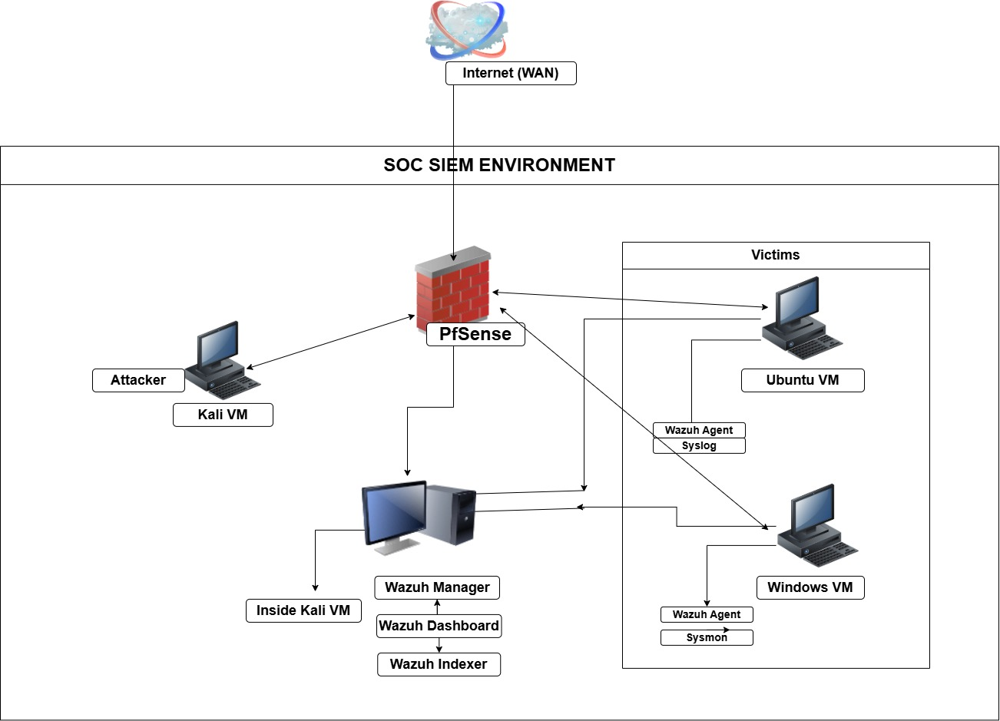
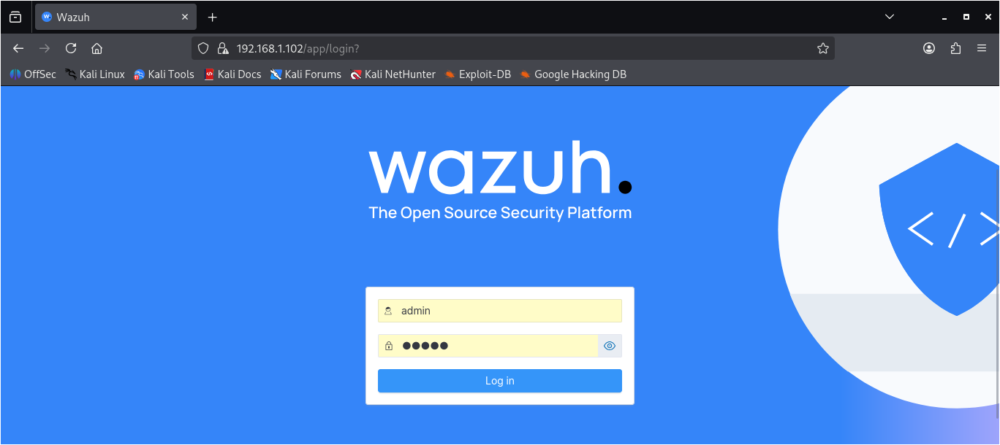
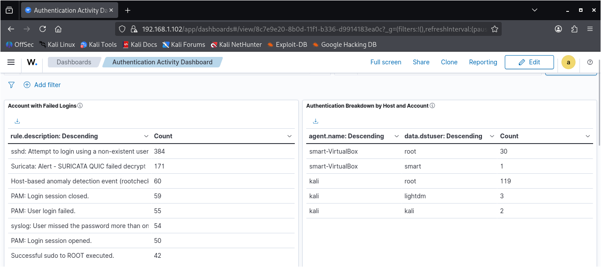
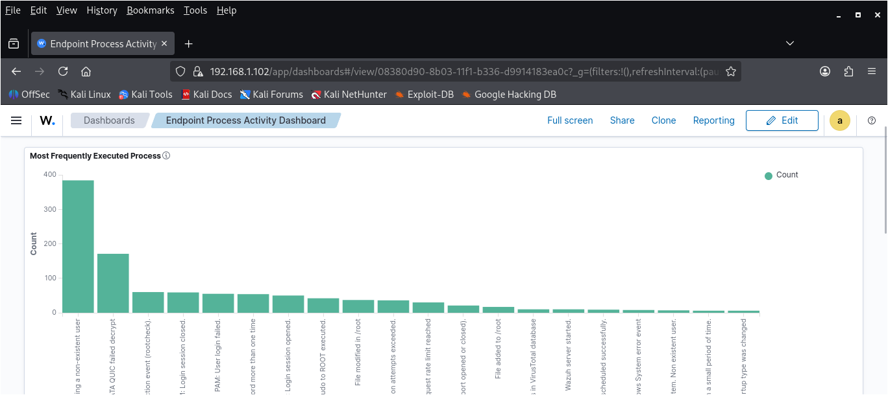
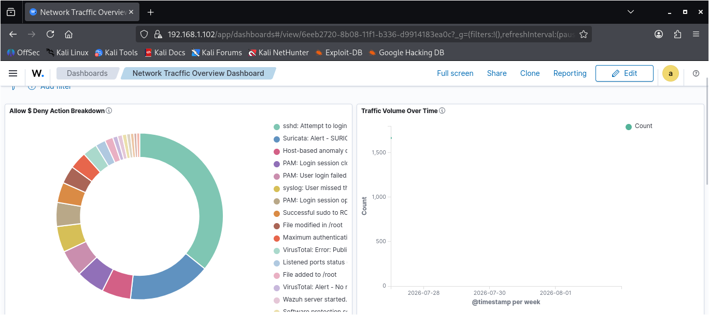
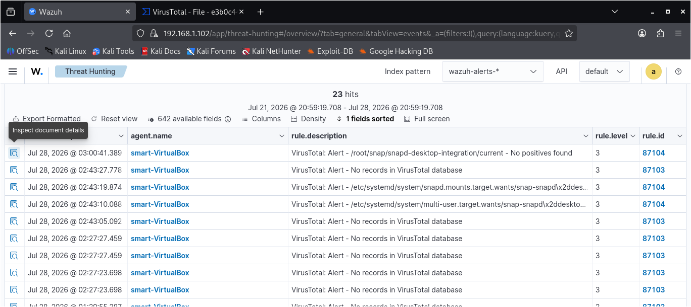
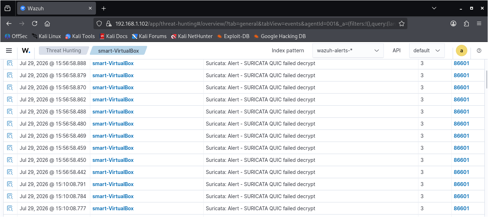

# Home SOC Lab

## Overview

This project documents the design, deployment, and expansion of a Security Operations Center (SOC) home lab built for hands-on blue team training, threat detection, log analysis, and incident investigation.

The lab simulates a small enterprise environment using Wazuh as the central SIEM platform, integrated with multiple security tools to provide endpoint monitoring, network visibility, threat intelligence enrichment, and custom detection capabilities.

## Project Objectives

- Build a functional SOC home lab using virtual machines.
- Collect and centralize logs from multiple endpoints.
- Develop and test custom Wazuh correlation rules.
- Simulate attacks and validate detection capabilities.
- Create dashboards for monitoring security events.

## Lab Architecture

The lab consists of the following components:

- *Hypervisor:* Oracle VirtualBox
- *Host Operating System:* Windows 11
- *Wazuh Manager:* Kali Linux
- *Endpoint 1:* Ubuntu Server with Wazuh Agent and Suricata
- *Endpoint 2:* Windows 11 with Wazuh Agent and Sysmon
- *Firewall:* pfSense
- *Threat Intelligence:* VirusTotal Integration

### Architecture Diagram

## Features

- Centralized log collection with Wazuh
- Endpoint monitoring for Windows and Ubuntu
- Network intrusion detection using Suricata
- PowerShell Script Block Logging
- Threat Intelligence integration with VirusTotal
- Custom Wazuh detection rules
- Security dashboards for event visualization
- pfSense firewall for network segmentation

- ## Screenshots

- ### Lab Architecture
- 

### Wazuh Dashboard

### Authentication Dashboard

### Endpoint Process Dashboard

### Network Activity Dashboard

### VirusTotal Integration

### Suricata Alerts

## Correlation Rules

This project includes two custom Wazuh correlation rules developed and tested to improve threat detection within the SOC home lab.

### Brute Force Detection Rule

> This section will contain the rule, explanation, and testing screenshots.

### Suspicious Process Execution Rule

> This section will contain the rule, explanation, and testing screenshots.
