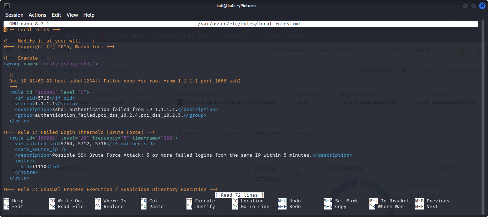
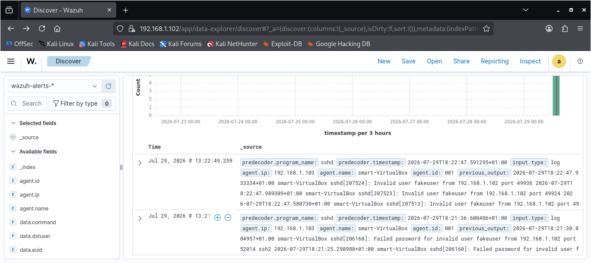
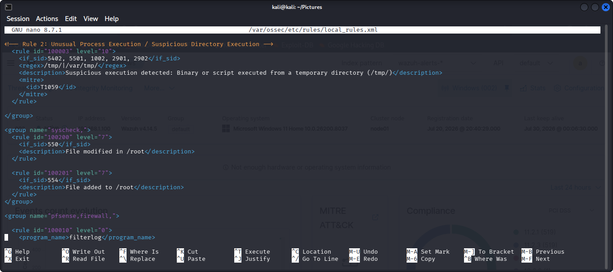
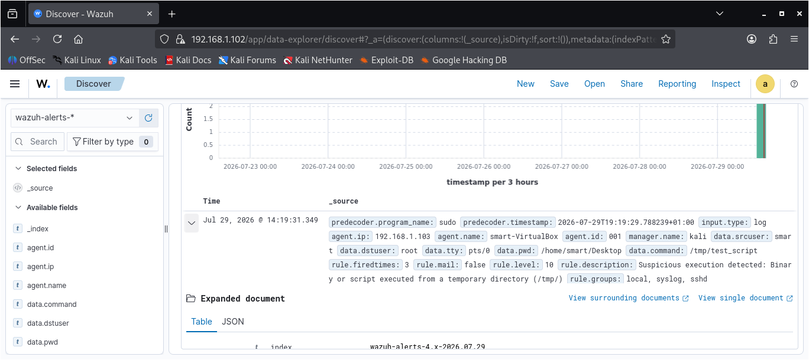

# Home SOC Lab

## Overview

This project documents the design, deployment, and expansion of a Security Operations Center (SOC) home lab built for hands-on blue team training, threat detection, log analysis, and incident investigation.

The lab simulates a small enterprise environment using Wazuh as the central SIEM platform, integrated with multiple security tools to provide endpoint monitoring, network visibility, threat intelligence enrichment, and custom detection capabilities.

## Project Objectives

- Build a functional SOC home lab using virtual machines.
- Collect and centralize logs from multiple endpoints.
- Develop and test custom Wazuh correlation rules.
- Simulate attacks and validate detection capabilities.
- Create dashboards for monitoring security events.

## Lab Architecture

The lab consists of the following components:

- *Hypervisor:* Oracle VirtualBox
- *Host Operating System:* Windows 11
- *Wazuh Manager:* Kali Linux
- *Endpoint 1:* Ubuntu Server with Wazuh Agent and Suricata
- *Endpoint 2:* Windows 11 with Wazuh Agent and Sysmon
- *Firewall:* pfSense
- *Threat Intelligence:* VirusTotal Integration

### Architecture Diagram

## Features

- Centralized log collection with Wazuh
- Endpoint monitoring for Windows and Ubuntu
- Network intrusion detection using Suricata
- PowerShell Script Block Logging
- Threat Intelligence integration with VirusTotal
- Custom Wazuh detection rules
- Security dashboards for event visualization
- pfSense firewall for network segmentation

- ## Screenshots

- ### Lab Architecture
- 

### Wazuh Dashboard

### Authentication Dashboard

### Endpoint Process Dashboard

### Network Activity Dashboard

### VirusTotal Integration

### Suricata Alerts

## Correlation Rules

This project includes two custom Wazuh correlation rules developed and tested to improve threat detection within the SOC home lab.

### Brute Force Detection Rule
This custom Wazuh correlation rule detects multiple failed login attempts from the same source IP address within a short period. The rule is designed to identify brute-force attacks against SSH services.

*Detection Logic*

- Monitors repeated authentication failures.
- Triggers after *5 failed login attempts within 5 minutes*.
- Mapped to *MITRE ATT&CK T1110 – Brute Force*.

### Rule Configuration

### Test Scenario

### Suspicious Process Execution Rule

This custom Wazuh correlation rule detects the execution of suspicious or unauthorized processes on monitored endpoints. It helps identify potentially malicious activity that may indicate malware execution or attacker behavior.

*Detection Logic*

- Monitors suspicious process creation events.
- Detects predefined high-risk executables.
- Generates a high-severity alert for investigation.

### Rule Configuration

### Test Scenario

## Documentation

A detailed report describing the design, implementation, configuration, testing, and results of this SOC Home Lab project is available below.

[SOC Home Lab Project Report](docs/SOC%20Home%20Lab%20Project%20Report.pdf)
