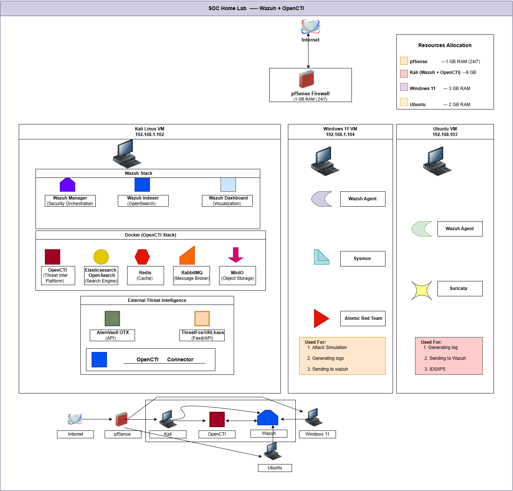
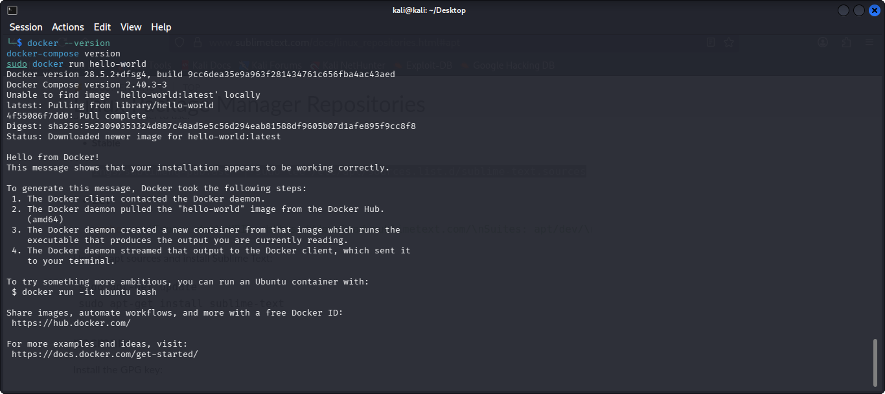
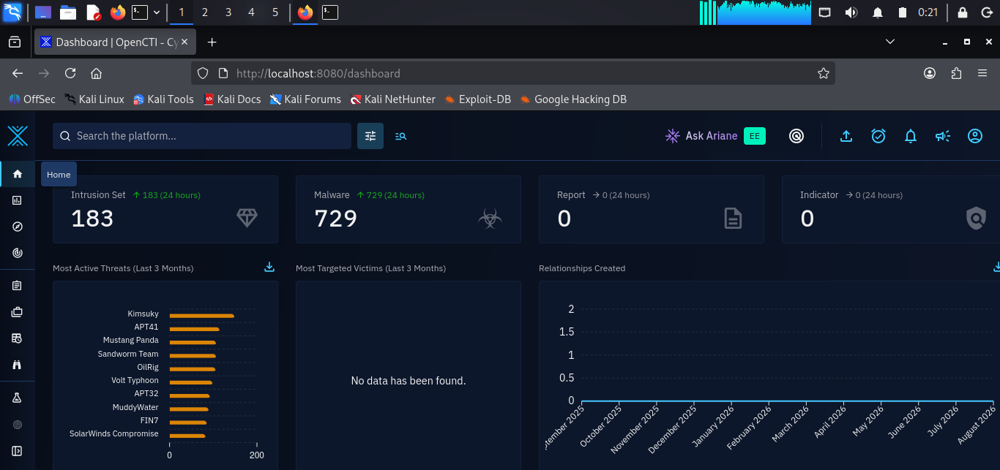
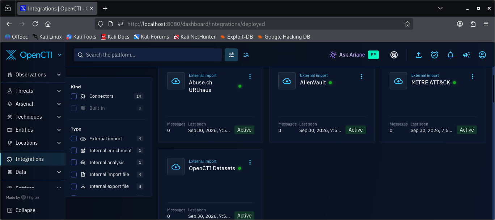
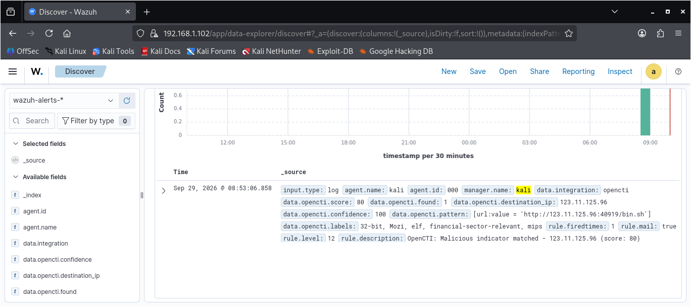
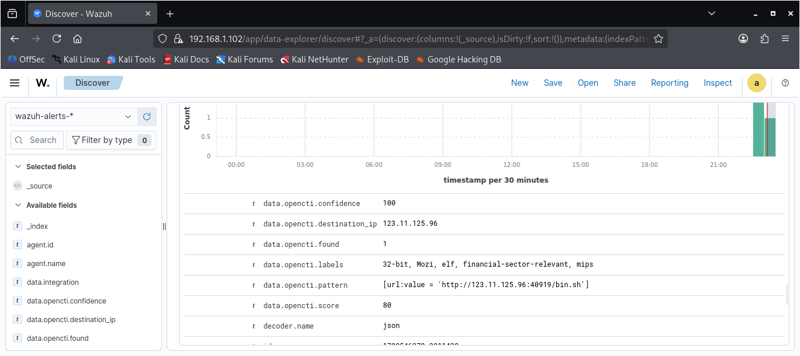

# OpenCTI + Wazuh Threat Intelligence Integration

A threat-intelligence enrichment project that integrates **OpenCTI with Wazuh** to add contextual intelligence to security events detected within a SOC home laboratory.

The project connects Wazuh with **OpenCTI**, **URLhaus**, **AlienVault OTX**, and **MITRE ATT&CK**, using a custom Python integration to query OpenCTI through its GraphQL API. When a monitored security event contains a relevant indicator, the integration queries OpenCTI and returns threat intelligence such as threat score, confidence, labels, malware context, and MITRE ATT&CK information.

The resulting intelligence is processed by custom Wazuh rules and presented as an enriched security alert for analyst investigation.

**Core workflow:**

`Security Event → Wazuh → OpenCTI GraphQL → Indicator Matching → Threat Intelligence Enrichment → Wazuh Alert`


## Project Overview

This project extends an existing **Security Operations Center (SOC) home laboratory** by introducing OpenCTI as a structured cyber threat intelligence platform and integrating it with Wazuh.

The implementation was designed to move beyond isolated security-event detection by allowing observed activity to be compared against external threat intelligence. This enables Wazuh alerts to be enriched with additional context, including malicious indicators, confidence levels, threat scores, labels, malware information, and MITRE ATT&CK data.

The project uses **OpenCTI**, **Wazuh**, **URLhaus**, **AlienVault OTX**, and **MITRE ATT&CK**, with a custom Python integration serving as the bridge between Wazuh and the OpenCTI GraphQL API.

The final implementation demonstrated an end-to-end workflow in which a known malicious URLhaus indicator was detected, queried against OpenCTI, enriched with threat intelligence, and returned to Wazuh as a high-severity alert.


## Scope & Objectives

### Scope

The project focused on integrating **OpenCTI into an existing Wazuh-based SOC home laboratory** to provide structured threat-intelligence enrichment for security events.

The implementation covered:

- Deployment and configuration of OpenCTI using Docker Compose.
- Integration of **URLhaus**, **AlienVault OTX**, and **MITRE ATT&CK**.
- Development of a custom Python-based integration between Wazuh and the OpenCTI GraphQL API.
- Extraction and correlation of indicators such as IP addresses from monitored security events.
- Enrichment of Wazuh alerts with threat scores, confidence levels, labels, malware context, and MITRE ATT&CK information.
- Application of threat intelligence to existing Wazuh detection use cases.
- Testing using Linux `auditd` network connection events and SSH activity.
- End-to-end validation using a known malicious URLhaus indicator.

All technical validation was performed within the controlled laboratory environment or against known threat-intelligence indicators. The project did **not** include penetration testing, exploitation of external systems, unauthorized scanning, or security assessment of third-party organizations.

### Objectives

The main objective was to integrate OpenCTI with Wazuh to enhance security-event detection with structured and contextual threat intelligence.

Specific objectives included:

1. Deploy OpenCTI within the existing SOC laboratory environment.
2. Integrate URLhaus, AlienVault OTX, and MITRE ATT&CK.
3. Develop a custom Wazuh-to-OpenCTI integration using the OpenCTI GraphQL API.
4. Extract and correlate indicators from monitored security events with intelligence stored in OpenCTI.
5. Enrich Wazuh alerts with threat intelligence when an indicator match is identified.
6. Create dedicated Wazuh rules to process enrichment results.
7. Apply threat intelligence enrichment to an existing SOC detection.
8. Validate the complete workflow from security-event generation to the final enriched Wazuh alert.
9. Document implementation challenges and their resolutions.
10. Demonstrate the practical use of OpenCTI for organizational threat intelligence.

 ## Methodology

The project was implemented in four major stages:

1. **OpenCTI Deployment and Configuration**  
   OpenCTI was deployed within the existing Kali Linux SOC environment using Docker Compose and configured with its required supporting services.

2. **Threat Intelligence Feed Integration**  
   External intelligence sources were connected to OpenCTI, including URLhaus, AlienVault OTX, and MITRE ATT&CK.

3. **Wazuh-to-OpenCTI Enrichment Pipeline**  
   A custom Python integration was developed to receive relevant Wazuh alerts, extract indicators, query OpenCTI through its GraphQL API, and return the resulting threat intelligence to Wazuh.

4. **Application to SOC Detection and Validation**  
   The enrichment workflow was applied to network and SSH-related security events and validated using a known malicious URLhaus indicator.

   
## Architecture & Environment

The project extended the existing SOC laboratory by introducing **OpenCTI as the threat-intelligence layer** alongside the existing Wazuh monitoring infrastructure.



*Figure: Final architecture of the SOC environment showing the relationship between the network, endpoints, Wazuh, OpenCTI, and external threat-intelligence sources.*

### Architecture Overview

The architecture begins at the **Internet**, where traffic enters the laboratory through the **pfSense firewall**. pfSense provides the network boundary and connects the external network to the internal virtual environment.

Inside the internal network are the laboratory systems used for security monitoring and testing:

- **Kali Linux** — the central system for the project. It hosts the Wazuh Manager, Wazuh Indexer, Wazuh Dashboard, and the Docker-based OpenCTI deployment.
- **Windows 11** — provides Windows endpoint telemetry through the Wazuh Agent and Sysmon and was also used with Atomic Red Team for security-event generation.
- **Ubuntu** — provides Linux endpoint telemetry through the Wazuh Agent.

### Wazuh Layer

Wazuh remains responsible for collecting and processing security telemetry from the monitored endpoints.

Endpoint activity is forwarded to Wazuh, where events are processed by the Wazuh Manager and presented through the Wazuh Dashboard. The project therefore keeps the existing SIEM and detection workflow while adding threat-intelligence enrichment on top of it.

### OpenCTI Layer

OpenCTI was introduced as the central **threat-intelligence platform**.

It runs on Kali through Docker and uses supporting services including **Elasticsearch/OpenSearch, Redis, RabbitMQ, and MinIO**.

OpenCTI provides the platform for storing, organizing, correlating, and querying threat intelligence from external sources.

### External Threat Intelligence

The architecture also shows external threat-intelligence sources feeding information into OpenCTI.

For the implemented project, the primary sources were **URLhaus** and **AlienVault OTX**, with **MITRE ATT&CK** providing structured adversary, malware, and technique relationships.

This allows an indicator observed in a Wazuh security event to be compared with intelligence already available in OpenCTI.

### Wazuh–OpenCTI Integration

The key addition introduced by this project is the connection between **Wazuh and OpenCTI**.

A custom Python integration, `custom-opencti.py`, acts as the bridge. When Wazuh generates a relevant security event, the integration extracts the indicator, queries OpenCTI through its **GraphQL API**, and returns the available threat-intelligence context.

The resulting workflow is:

```text
Security Event
      ↓
    Wazuh
      ↓
Indicator Extraction
      ↓
OpenCTI GraphQL Query
      ↓
Threat Intelligence Match
      ↓
Score / Confidence / Labels / Context
      ↓
Enriched Wazuh Alert
```

This architecture therefore extends the existing SOC monitoring capability without replacing Wazuh. **Wazuh remains responsible for detection and alerting, while OpenCTI provides the intelligence context needed to give those alerts greater investigative value.**

## Phase One — OpenCTI Deployment & Configuration

The first phase focused on deploying and preparing **OpenCTI** within the existing SOC laboratory environment.

Due to available system resources, OpenCTI was deployed directly on the existing **Kali Linux** system using **Docker Compose** rather than creating an additional virtual machine.

### OpenCTI Deployment

OpenCTI was deployed together with its supporting services required for the platform to operate, including:

- Elasticsearch/OpenSearch
- Redis
- RabbitMQ
- MinIO

The deployment provided the foundation for collecting, storing, correlating, and querying threat-intelligence data within the laboratory.



*Figure: Docker deployment.*

### Initial OpenCTI Configuration

After deployment, OpenCTI was configured as the central threat-intelligence platform for the integration project.

The **MITRE ATT&CK** intelligence source was enabled during this phase to provide structured information about adversaries, malware, and attack techniques.

This established the initial intelligence layer that would later be combined with additional external sources such as **URLhaus** and **AlienVault OTX**.

### Phase One Outcome

At the end of this phase, OpenCTI was deployed and configured as the threat-intelligence platform that would support the subsequent Wazuh integration and enrichment workflow.

The next phase focused on populating OpenCTI with additional external threat-intelligence data.


*Figure: OpenCTI  Dashboard with indicators populated.*


## Phase Two — Threat Intelligence Feed Integration

With OpenCTI deployed, the second phase focused on populating the platform with external threat intelligence that could later be used to enrich Wazuh security events.

Three intelligence sources were incorporated into the project:

- **URLhaus** — provided malicious URL and IP-based indicators.
- **AlienVault OTX** — provided threat intelligence through its collection of pulses and associated indicators.
- **MITRE ATT&CK** — provided structured adversary, malware, and attack-technique information.



*Figure: OpenCTI threat-intelligence sources configured for the project.*

### URLhaus

URLhaus was used as a source of known malicious indicators. More than **900 indicators** were available from the feed and were later used to support indicator matching and validation.

### AlienVault OTX

AlienVault OTX was integrated to provide additional threat-intelligence context through its available pulses and indicators. The implementation retrieved **99 pulses**, providing a broader intelligence source for correlation within OpenCTI.

### MITRE ATT&CK

MITRE ATT&CK was used to provide structured relationships between adversaries, malware, and attack techniques. This allowed enrichment results to include ATT&CK context where applicable.

### ThreatFox

ThreatFox was considered as an additional intelligence source during the project but was **not included in the final implementation** because of the resource limitations of the laboratory environment.

### Phase Two Outcome

The completed feed configuration established OpenCTI as the central repository for the project's external threat intelligence.

The intelligence collected during this phase provided the data required for the next phase: building the custom **Wazuh-to-OpenCTI enrichment integration**.


## Phase Three — Wazuh-to-OpenCTI Integration

The third phase focused on building the connection between **Wazuh** and **OpenCTI** so that security events detected by Wazuh could be enriched with threat-intelligence context.

A custom Python integration, `custom-opencti.py`, was developed to act as the bridge between the two platforms.

### Integration Workflow

When a relevant Wazuh event is generated, the integration:

1. Receives the Wazuh alert.
2. Extracts the relevant indicator from the event.
3. Queries OpenCTI through its **GraphQL API**.
4. Checks whether the indicator exists in the available threat intelligence.
5. Retrieves relevant intelligence when a match is found.
6. Returns the enrichment information for processing by Wazuh.

The resulting workflow is:

```text
Wazuh Security Event
        ↓
Indicator Extraction
        ↓
custom-opencti.py
        ↓
OpenCTI GraphQL API
        ↓
Indicator Matching
        ↓
Threat Intelligence Enrichment
        ↓
Wazuh Processing
```

### Wazuh Integration Configuration

The integration was configured to process relevant event groups, including network connection and SSH-related activity.

The implementation also required the integration to use the **`custom-opencti`** naming convention because Wazuh requires custom integrations to use the appropriate custom prefix.

The integration was configured to support the relevant event groups:

```text
sysmon_event3
network_connect
ssh_brute_force
sshd
```

### Enrichment Data

When an indicator matched intelligence in OpenCTI, the returned context could include information such as:

- Threat score
- Confidence level
- Labels
- Malware context
- MITRE ATT&CK information

This transformed a basic security event into a more context-rich event that could provide additional investigative value to a SOC analyst.

### Telemetry Adjustment

The original implementation was designed around Windows **Sysmon Event ID 3** network telemetry. However, resource limitations and the laboratory environment led to the primary final validation being performed with Linux **`auditd` `network_connect`** events.

The Sysmon integration path was retained as part of the implementation, while `auditd` provided the practical validation path used for the final end-to-end test.

### Phase Three Outcome

At the end of this phase, the Wazuh environment was capable of sending relevant security-event information through the custom integration to OpenCTI for indicator matching and threat-intelligence enrichment.

The next step was to ensure that the returned enrichment could be processed into a usable Wazuh alert.

## Phase Four — Wazuh Enrichment Rules & Alert Processing

The fourth phase focused on processing the threat-intelligence information returned by the OpenCTI integration and converting it into a usable Wazuh alert.

During testing, the enrichment returned through the integration's Unix socket did not automatically appear as a dashboard alert. Additional Wazuh rules were therefore required to process the returned data.

### Custom Enrichment Rules

Custom Wazuh rules **100150–100152** were created to process the OpenCTI enrichment results.

The final high-severity enrichment rule was:

```text
Rule ID: 100152
Level: 12
```

This allowed an OpenCTI indicator match to be represented as a high-severity Wazuh alert rather than remaining only as integration output.

### Integration Debugging

`integrator.debug=2` was enabled during troubleshooting to provide additional visibility into the communication between Wazuh and the custom integration.

This helped confirm that the integration was receiving relevant events and returning enrichment information, while also exposing the distinction between successful enrichment through the integration and successful presentation of that enrichment as a Wazuh dashboard alert.

### Enriched Wazuh Alert



*Figure: Wazuh Dashboard displaying the threat-intelligence-enriched security alert.*

The dashboard result confirmed that the OpenCTI enrichment had been processed into a Wazuh alert, providing the analyst with additional threat-intelligence context alongside the original security event.

### Alert Processing Flow

```text
Security Event
      ↓
Wazuh Detection
      ↓
custom-opencti.py
      ↓
OpenCTI GraphQL Query
      ↓
Indicator Match
      ↓
Threat Intelligence Returned
      ↓
Custom Wazuh Enrichment Rules
      ↓
High-Severity Enriched Alert
```

### Phase Four Outcome

This phase completed the processing layer required to turn OpenCTI enrichment into an actionable Wazuh alert.

The final validation confirmed the complete workflow from security-event detection through OpenCTI enrichment to the resulting Wazuh Dashboard alert.

## End-to-End Validation

The final phase validated the complete threat-intelligence enrichment workflow using a known malicious indicator obtained from **URLhaus**.

The indicator used for validation was:

```text
123.11.125.96:40919/bin.sh
```

The indicator was processed through the completed Wazuh-to-OpenCTI workflow to confirm that a security event could be detected, matched against threat intelligence, enriched, and presented as a high-severity Wazuh alert.

### Validation Workflow

The validation followed the complete chain:

```text
Malicious Indicator
        ↓
Security Event Generated
        ↓
Wazuh Detection
        ↓
Indicator Extracted
        ↓
OpenCTI GraphQL Query
        ↓
URLhaus Intelligence Match
        ↓
Threat Context Returned
        ↓
Wazuh Rule 100152
        ↓
Level 12 Enriched Alert
```

### OpenCTI Intelligence Result

The matched indicator returned threat-intelligence context from OpenCTI, including:

- **Threat Score:** 80
- **Confidence:** 100
- **Labels:** Mozi
- **Context:** Financial-sector relevant
- **Additional context:** ELF/MIPS

This demonstrated that the integration was not simply identifying an IP address, but was successfully adding contextual intelligence to the detected activity.

### Final Validation Result

The enriched event was processed by Wazuh **rule 100152 at level 12**, confirming that the threat-intelligence match could be translated into a high-severity SOC alert.

The result demonstrated the project's intended end-to-end capability:

> **Detect → Extract → Query → Match → Enrich → Alert**

The completed workflow showed how OpenCTI can extend Wazuh detection by providing additional intelligence that helps an analyst understand the potential significance of an observed indicator.

### Phase Five Outcome

The end-to-end validation successfully demonstrated the core objective of the project: integrating external threat intelligence into the Wazuh detection workflow and presenting the resulting context as an enriched SOC alert.




## Challenges & Troubleshooting

Several technical challenges were encountered during the implementation. These issues affected system performance, telemetry collection, integration behavior, and alert processing.

### 1. Resource Constraints

The largest challenge was limited system memory. Running Wazuh, OpenCTI, and its supporting services together placed significant pressure on the available RAM.

Elasticsearch/OpenSearch became unhealthy when its memory requirements increased, while system swap usage also increased.

**Resolution:** The project was executed in stages rather than attempting to run the entire environment continuously at the same time. Resource-intensive components were started only when required for a specific phase of testing.

### 2. Telemetry Source Change

The original implementation path used Windows Sysmon Event ID 3 for network connection telemetry. Due to resource constraints in the laboratory environment, the final primary validation was performed using Linux `auditd` `network_connect` events.

**Resolution:** The integration was adapted to process the available Linux network telemetry while retaining the Sysmon path for the broader implementation.

### 3. Custom Integration Naming

The initial integration naming caused compatibility issues because Wazuh requires custom integrations to follow its custom integration naming convention.

**Resolution:** The integration was configured as:

```text
custom-opencti
```

This allowed Wazuh to recognize and execute the custom integration correctly.

### 4. Integration Output vs Dashboard Alert

The OpenCTI enrichment was successfully returned through the integration's Unix socket, but the returned information did not automatically appear as a normal Wazuh Dashboard alert.

**Resolution:** Additional custom Wazuh rules, **100150–100152**, were created to process the enrichment output and generate a corresponding alert. Rule **100152** was configured as the high-severity enrichment rule.

### 5. Auditd Rule Persistence

The `auditd` network monitoring configuration required attention because manually created audit rules were not automatically persistent across system restarts.

**Resolution:** The audit configuration was tested and adjusted as part of the validation process so that the required `network_connect` telemetry could be generated reliably during testing.

### 6. Wazuh Rule Hierarchy

The custom network monitoring rule needed to be positioned correctly within the Wazuh rule hierarchy. The custom rule was configured as a child of the relevant built-in audit rule.

This ensured that the expected `network_connect` events could be matched and processed by the custom detection logic.

### 7. SSH Brute-Force Correlation

The custom SSH brute-force rule did not reliably trigger during testing, even after repeated failed authentication attempts.

Because the rule could not be relied upon for final validation, the project used another validated SSH-related detection path for enrichment testing.

**Resolution:** SSH remote-service activity associated with **T1021.004** was successfully used as an alternative enrichment scenario, while the brute-force rule limitation was documented rather than presenting it as a successful result.

### 8. Manager Startup Delay

The additional services and resource requirements also affected Wazuh Manager startup behavior.

**Resolution:** The manager service startup timeout was increased to allow sufficient time for the environment to initialize under the available resources.

### Overall Lesson

The troubleshooting process demonstrated that successful threat-intelligence integration depends not only on the intelligence platform and integration code, but also on **resource planning, telemetry reliability, rule hierarchy, alert-processing behavior, and careful validation of each stage of the pipeline**.


## Recommendations & Next Steps

Based on the implementation and the challenges encountered, the following improvements are recommended for future development of the project.

### Recommendations

- **Increase available system resources** or move OpenCTI to a dedicated virtual machine to reduce resource contention between Wazuh and OpenCTI.
- **Improve Elasticsearch/OpenSearch resource allocation** to provide more stable OpenCTI operation.
- **Restore continuous Windows Sysmon testing** when sufficient resources are available, allowing the original Windows network-telemetry path to be used more consistently.
- **Improve auditd persistence** so required network-monitoring rules remain active after system restarts.
- **Review and improve the SSH brute-force detection rule** so repeated failed authentication attempts can be detected reliably.
- **Expand the threat-intelligence sources** by adding feeds such as ThreatFox when additional system resources are available.
- **Improve enrichment persistence and alert context** so threat-intelligence results can be retained and presented consistently for analyst investigation.

### Next Steps

Future development of the project could include:

1. Moving OpenCTI to a dedicated, higher-resource environment.
2. Running Wazuh and OpenCTI continuously together rather than sequentially.
3. Expanding the number of threat-intelligence feeds connected to OpenCTI.
4. Adding more indicator types, including domains, hashes, and URLs, to the enrichment workflow.
5. Expanding the custom Wazuh rules to support additional threat-intelligence scenarios.
6. Improving automated enrichment and analyst-facing context within Wazuh.
7. Testing the integration against a wider range of known malicious indicators.
8. Further developing the project into a more persistent and production-like SOC threat-intelligence pipeline.

## Project Documentation

The complete technical report for this project is available below:

📄 **[OpenCTI Threat Intelligence Report](documentation/OpenCTI_Threat_Intelligence_Report.pdf)**

The report contains the detailed implementation process, configuration, testing, troubleshooting, validation results, and supporting technical evidence for the project.
