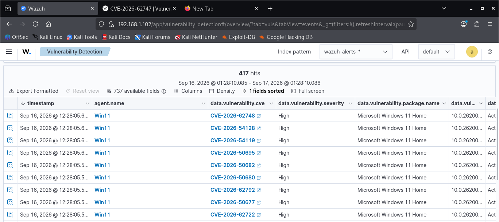
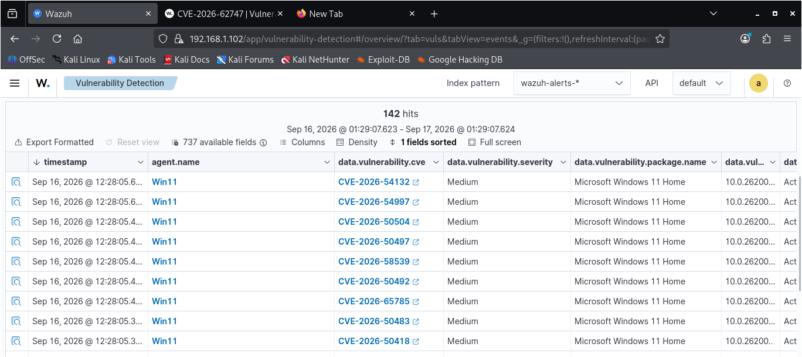
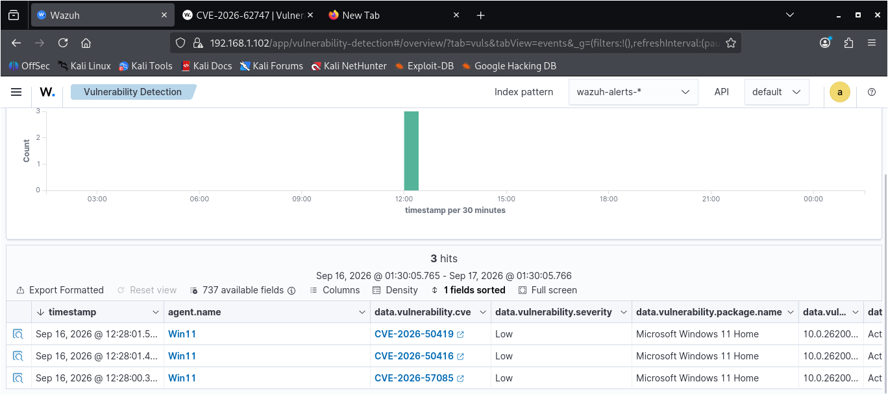
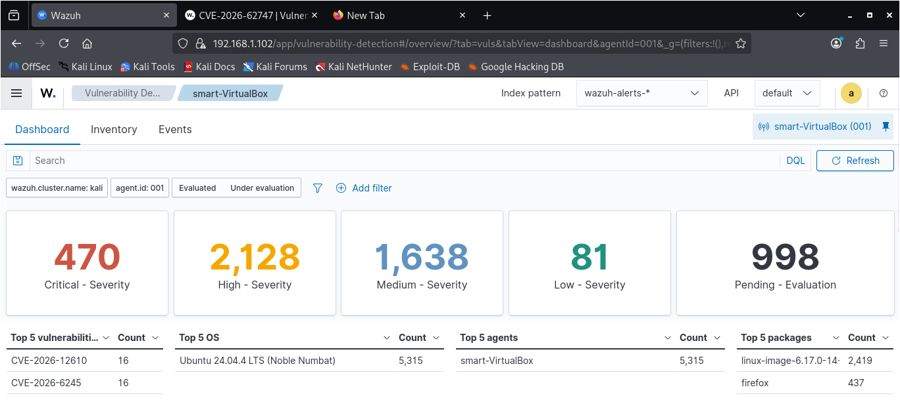

# Vulnerability Management

**From Detection to Decision: Finding, Prioritizing, and Fixing Real Vulnerabilities**

##  Project Overview

This project focused on vulnerability management within my Wazuh SOC home lab.

The goal was to move beyond security monitoring and detection by identifying vulnerabilities present across monitored endpoints, assessing their risk, prioritizing the most important findings, and applying appropriate remediation or mitigation actions.

The assessment was performed across a Windows 11 endpoint and an Ubuntu Linux VM using Wazuh's built-in Vulnerability Detection capability, with vulnerability data correlated against the NVD feed.

The project also involved troubleshooting the vulnerability-management pipeline when findings were not initially appearing correctly in the Wazuh Dashboard and Inventory views.

By the end of the assessment, **2,888 vulnerability findings** had been identified across both endpoints, with findings further analyzed against the **CISA Known Exploited Vulnerabilities (KEV) catalog** to identify vulnerabilities with confirmed active exploitation.


##  Objective

The objective of this project was to extend my Wazuh SOC home lab from threat detection and monitoring into proactive vulnerability management.

The project focused on:

- Identifying vulnerabilities across monitored endpoints.
- Assessing the severity and potential risk of identified vulnerabilities.
- Cross-referencing high and critical findings against the CISA Known Exploited Vulnerabilities (KEV) catalog.
- Prioritizing vulnerabilities using CVSS severity, KEV status, and asset criticality.
- Applying appropriate remediation or compensating controls to priority findings.
- Verifying remediation through follow-up checks and vulnerability re-scans.
- Documenting the troubleshooting required to get the vulnerability-management pipeline working correctly.

The overall goal was to turn a large volume of vulnerability findings into a focused and actionable remediation plan.

##  Lab Environment

The vulnerability assessment was conducted within my Wazuh SOC home lab.

| Asset | Operating System | Role |
|---|---|---|
| **Win11** | Windows 11 Home | Attack-simulation endpoint running Atomic Red Team, Sysmon, and PowerShell Script Block Logging |
| **smart-VirtualBox** | Ubuntu Linux | Network detection sensor running Suricata |

### Wazuh Infrastructure

The Wazuh manager was hosted on a **Kali Linux VM** and was responsible for vulnerability detection and correlation of endpoint software inventory against the NVD vulnerability feed.

Both endpoints were monitored through the Wazuh Agent and reported software inventory through Syscollector.

The two endpoints were treated as critical components of the lab:

- **Win11** generates the attack telemetry used for detection testing.
- **smart-VirtualBox** runs Suricata and serves as the lab's network-based detection sensor.

This meant that vulnerabilities affecting either endpoint could impact an important part of the lab's security-monitoring capability.

##  Tools & Technologies

| Tool / Technology | Purpose |
|---|---|
| **Wazuh** | SIEM and Vulnerability Detection |
| **NVD** | Vulnerability intelligence and CVSS reference |
| **CISA KEV Catalog** | Identifying vulnerabilities confirmed as exploited |
| **Python** | Cross-referencing vulnerability findings against KEV |
| **PowerShell** | Windows remediation and exploit-mitigation controls |
| **APT** | Ubuntu package and kernel remediation |

##  Methodology

The vulnerability-management process followed these main stages:

1. **Vulnerability Detection** — Enabled and verified Wazuh Vulnerability Detection across the monitored endpoints.

2. **Vulnerability Assessment** — Reviewed detected vulnerabilities and their severity levels using CVSS information from the NVD.

3. **KEV Cross-Reference** — Cross-referenced High and Critical findings against the CISA Known Exploited Vulnerabilities (KEV) catalog to identify vulnerabilities with confirmed exploitation.

4. **Risk Prioritization** — Prioritized findings using vulnerability severity, KEV status, and asset criticality.

5. **Remediation and Mitigation** — Applied appropriate remediation or compensating controls to priority vulnerabilities.

6. **Verification** — Performed follow-up checks and vulnerability re-scans to confirm whether remediation actions were effective.

7. **Documentation** — Documented the findings, troubleshooting process, remediation decisions, and remaining risks.


##  Troubleshooting the Vulnerability Management Pipeline

Before the vulnerability findings could be reliably reviewed, I encountered several infrastructure issues affecting the Wazuh Vulnerability Detection pipeline.

The troubleshooting process involved three main issues:

1. The vulnerability feed failed to complete its update.
2. The Dashboard and Inventory remained empty even though vulnerability events were appearing.
3. Ubuntu vulnerability correlation failed because its package inventory was not reaching the indexer.

---

### 6.1 Vulnerability Feed Issue

#### Symptom

After enabling Wazuh Vulnerability Detection, no vulnerability findings were appearing.

I first checked the Wazuh manager logs for vulnerability scanner activity:

```bash
sudo grep -a -i "vulnerability-scanner" /var/ossec/logs/ossec.log | tail -30
```

The logs showed that the feed update had started with:

```text
Initiating update feed process
```

However, there was no corresponding completion message.

I then checked the content manager queue to determine whether the feed data had actually been downloaded. The queue was empty, indicating that the expected feed content had not been written.

To expose the underlying error, I widened the log search:

```bash
sudo grep -a -i "vulnerability-scanner" /var/ossec/logs/ossec.log | grep -iE "error|fail"
```

This revealed:

```text
ERROR: Error updating feed: [json.exception.out_of_range.401] array index 1 is out of range
```

#### Initial Fix Attempt

I stopped the Wazuh manager, cleared the vulnerability scanner and content manager cache, and restarted the manager to force a clean feed download:

```bash
sudo systemctl stop wazuh-manager
sudo rm -rf /var/ossec/queue/vulnerability_scanner /var/ossec/queue/content_manager
sudo systemctl start wazuh-manager
```

However, a new error appeared:

```text
ERROR: Error opening the database: Error getting CNA Mapping content from rocksdb.
```

This indicated that the problem was deeper than the cached feed files. The local vulnerability database itself appeared to be corrupted.

#### Locating the Database

I searched the Wazuh installation for the relevant RocksDB and vulnerability directories:

```bash
sudo find /var/ossec -iname "*rocksdb*" -o -iname "*vulnerability*" 2>/dev/null
```

The vulnerability database was located at:

```text
/var/ossec/queue/vd_updater/rocksdb
```

#### Root-Cause Fix

I stopped the manager, removed the corrupted vulnerability database directory, and allowed Wazuh to rebuild it:

```bash
sudo systemctl stop wazuh-manager
sudo rm -rf /var/ossec/queue/vd_updater
sudo systemctl start wazuh-manager
```

I also verified that network connectivity and DNS were not responsible for the feed failure by testing the Wazuh CTI feed API directly:

```bash
curl -Is https://cti.wazuh.com/api/v1/catalog/contexts/vulnerability_feed_manager/consumers/vulnerability_content
```

After the database rebuild and a complete feed update cycle, the vulnerability scanner began processing the feed correctly.

Real CVE-mapped vulnerability events subsequently started appearing in Wazuh.

**Verification:** Vulnerability events were now being generated successfully.

---

### 6.2 Dashboard and Inventory Issue

#### Symptom

Although vulnerability events were now appearing, the Wazuh Dashboard and Inventory views still displayed:

```text
No results match your search criteria.
```

This created an important distinction: **the scanner was producing vulnerability events, but the state/inventory data required by the Dashboard was not being populated.**

I first checked whether the vulnerability state index existed:

```bash
curl -k -u admin:admin "https://localhost:9200/wazuh-states-vulnerabilities-*/_count?pretty"
```

The response showed:

```text
"total": 0
```

indicating that the expected vulnerability state index was not available.

#### Investigating the Indexer Connector

I then checked the Wazuh manager's indexer-connector logs:

```bash
sudo grep -a "indexer-connector" /var/ossec/logs/ossec.log | tail -20
```

The same failure was repeating across multiple `states-*` indices:

```text
WARNING: IndexerConnector initialization failed for index '...', retrying until the connection is successful.
```

This showed that the problem was not limited to vulnerability data. The manager's connector to the indexer was failing more generally.

I tested the indexer directly:

```bash
curl -k -u admin:admin "https://localhost:9200/_cluster/health?pretty"
```

The indexer was reachable, but the vulnerability state data was not being written.

#### Checking the Manager Certificate Configuration

I inspected the indexer configuration in `ossec.conf`:

```bash
sudo grep -A 10 "<indexer>" /var/ossec/etc/ossec.conf
```

The configuration referenced certificate files under:

```text
/etc/filebeat/certs/
```

I then checked whether those files actually existed:

```bash
sudo find / -iname "root-ca.pem" -o -iname "filebeat.pem" -o -iname "filebeat-key.pem" 2>/dev/null
```

The expected `/etc/filebeat/certs/` directory did not exist.

Instead, certificate files were found under:

```text
/etc/wazuh-indexer/certs/
```

The available client certificates were:

```text
admin.pem
admin-key.pem
```

These certificates were owned by the `wazuh-indexer` account and were not accessible to the `wazuh` user running the relevant manager components.

#### First Certificate Fix Attempt

I created the expected directory and copied the certificates into it:

```bash
sudo mkdir -p /etc/filebeat/certs

sudo cp /etc/wazuh-indexer/certs/root-ca.pem /etc/filebeat/certs/

sudo cp /etc/wazuh-indexer/certs/admin.pem \
/etc/filebeat/certs/filebeat.pem

sudo cp /etc/wazuh-indexer/certs/admin-key.pem \
/etc/filebeat/certs/filebeat-key.pem

sudo chown wazuh:wazuh /etc/filebeat/certs/*.pem

sudo chmod 640 /etc/filebeat/certs/*.pem

sudo systemctl restart wazuh-manager
```

The connector was still failing.

#### Testing the TLS Handshake Directly

Instead of relying on the generic Wazuh retry message, I tested the mutual TLS connection directly:

```bash
sudo curl -v \
--cacert /etc/filebeat/certs/root-ca.pem \
--cert /etc/filebeat/certs/filebeat.pem \
--key /etc/filebeat/certs/filebeat-key.pem \
"https://192.168.1.102:9200/_cluster/health?pretty"
```

The actual TLS error was:

```text
SSL: no alternative certificate subject name matches target ipv4 address '192.168.1.102'
```

This showed that the certificate did not contain a valid identity for the manager's IP address.

I inspected the certificate's Subject Alternative Name (SAN):

```bash
sudo openssl x509 \
-in /etc/filebeat/certs/filebeat.pem \
-noout -text | grep -A2 "Subject Alternative Name"
```

No SAN entry was returned.

#### Tracing the Certificate Problem to Its Source

I initially tried using a hostname instead of the IP address, but the certificate still failed because it had not been generated with the correct network identity.

I then located the Wazuh certificate-generation configuration and found that the nodes had originally been configured with:

```text
127.0.0.1
```

instead of the manager's actual LAN address:

```text
192.168.1.102
```

This explained why the generated certificates could not authenticate the manager-to-indexer connection using the real network address.

#### Root-Cause Fix

I corrected the certificate configuration:

```bash
sed -i 's/127.0.0.1/192.168.1.102/g' config.yml
```

I removed the previously generated certificates:

```bash
rm -rf wazuh-certificates
```

Then regenerated the certificates:

```bash
bash wazuh-certs-tool.sh -A
```

#### Deploying the New Certificates

The regenerated certificates were deployed to the Wazuh services.

**Indexer:**

```bash
sudo systemctl stop wazuh-indexer

sudo cp wazuh-certificates/{root-ca,admin,admin-key}.pem \
/etc/wazuh-indexer/certs/

sudo cp wazuh-certificates/node-1.pem \
/etc/wazuh-indexer/certs/indexer.pem

sudo cp wazuh-certificates/node-1-key.pem \
/etc/wazuh-indexer/certs/indexer-key.pem

sudo chown wazuh-indexer:wazuh-indexer \
/etc/wazuh-indexer/certs/*.pem

sudo chmod 640 /etc/wazuh-indexer/certs/*.pem

sudo systemctl start wazuh-indexer
```

**Dashboard:**

```bash
sudo systemctl stop wazuh-dashboard

sudo cp wazuh-certificates/{root-ca,dashboard,dashboard-key}.pem \
/etc/wazuh-dashboard/certs/

sudo chown wazuh-dashboard:wazuh-dashboard \
/etc/wazuh-dashboard/certs/*.pem

sudo chmod 640 /etc/wazuh-dashboard/certs/*.pem

sudo systemctl start wazuh-dashboard
```

**Manager / Indexer Connector:**

```bash
sudo cp wazuh-certificates/root-ca.pem \
/etc/filebeat/certs/

sudo cp wazuh-certificates/admin.pem \
/etc/filebeat/certs/filebeat.pem

sudo cp wazuh-certificates/admin-key.pem \
/etc/filebeat/certs/filebeat-key.pem

sudo chown wazuh:wazuh \
/etc/filebeat/certs/*.pem

sudo chmod 640 /etc/filebeat/certs/*.pem

sudo systemctl restart wazuh-manager
```

#### Verifying the New Certificates

I tested the TLS connection again:

```bash
sudo curl \
--cacert /etc/filebeat/certs/root-ca.pem \
--cert /etc/filebeat/certs/filebeat.pem \
--key /etc/filebeat/certs/filebeat-key.pem \
"https://192.168.1.102:9200/_cluster/health?pretty"
```

The connection succeeded and returned a healthy cluster status, including:

```text
active_shards_percent_as_number: 100.0
```

There was still one configuration mismatch to correct. The manager had temporarily been configured to use the hostname `node-1`, while the regenerated certificate was issued for the IP address.

I reverted the manager configuration back to the correct IP:

```bash
sudo sed -i \
's|https://node-1:9200|https://192.168.1.102:9200|' \
/var/ossec/etc/ossec.conf

sudo systemctl restart wazuh-manager
```

Finally, I checked the indexer-connector logs:

```bash
sudo grep -a "indexer-connector" \
/var/ossec/logs/ossec.log | tail -10
```

The logs showed successful initialization:

```text
INFO: IndexerConnector initialized successfully for index: wazuh-states-vulnerabilities-kali.
```

The other state indices also initialized successfully.

**Verification:** The Dashboard and Inventory began displaying the vulnerability and inventory data.

---

### 6.3 Ubuntu Vulnerability Detection Issue

#### Symptom

After the indexer connection issue was identified, Ubuntu presented a separate symptom.

Ubuntu's Syscollector data was being reported, including:

- Operating system information
- Services
- Installed packages

However, vulnerability findings were not being generated for the Ubuntu endpoint.

I checked the vulnerability scanner logs:

```bash
sudo grep -a "vulnerability-scanner" \
/var/ossec/logs/ossec.log | tail -10
```

The log contained:

```text
ERROR: VulnerabilityScannerFacade::initEventDispatcher:
json exception [304]
([json.exception.type_error.304] cannot use at() with null)
```

I then confirmed that no Ubuntu vulnerability findings were present:

```bash
curl -k -u admin:admin \
"https://localhost:9200/wazuh-alerts-*/_count?q=agent.id:001+AND+data.vulnerability.cve:*"
```

The result showed:

```text
"count": 0
```

#### Checking Ubuntu Package Inventory

Because vulnerability detection depends on endpoint software inventory, I checked whether Ubuntu's package information had reached the indexer:

```bash
curl -k -u admin:admin \
"https://localhost:9200/wazuh-states-inventory-packages-kali/_search?q=agent.id:001&size=5&pretty"
```

The response returned:

```text
index_not_found_exception
```

This connected the Ubuntu issue to the earlier indexer-connector problem.

#### Root Cause

The Ubuntu agent was collecting package information, but the package inventory could not be written to the required state index because the manager's indexer connector was not functioning correctly.

Without the package inventory in the indexer, the vulnerability scanner had insufficient inventory data to correlate Ubuntu's installed software with vulnerability information.

The JSON `null` error was therefore a downstream symptom of the missing inventory data rather than a separate Ubuntu installation problem.

#### Resolution

Once the certificate configuration was corrected and the indexer connector successfully initialized all state indices, Ubuntu's package inventory began flowing into the indexer.

Vulnerability correlation then started working.

A fresh vulnerability severity check confirmed that Ubuntu was now producing actual vulnerability results across multiple severity levels.

---

### Troubleshooting Outcome

The troubleshooting process ultimately identified two underlying infrastructure problems:

1. **A corrupted local vulnerability-scanner RocksDB database**, which prevented the vulnerability feed from being processed correctly.
2. **Incorrect certificate generation/network configuration**, which prevented the Wazuh manager's indexer connector from writing state and inventory data to the indexer.

The Dashboard, Inventory, and Ubuntu correlation problems were therefore downstream symptoms of the indexer-connector failure.

After rebuilding the vulnerability database and correcting the certificate configuration, the complete vulnerability-management pipeline was functioning:

```text
Vulnerability Feed
       ↓
Wazuh Vulnerability Scanner
       ↓
Endpoint Software Inventory
       ↓
Indexer / State Indices
       ↓
Dashboard & Inventory
       ↓
CVE-Mapped Vulnerability Findings
```

This troubleshooting phase established that the findings could be trusted as the output of a functioning vulnerability-management pipeline rather than relying on incomplete or partially populated data.


##  Vulnerability Findings

The vulnerability assessment identified **2,888 vulnerability findings** across the two monitored endpoints.

### Windows 11 — Win11

| Severity | Findings |
|---|---:|
| Critical | 0 |
| High | 417 |
| Medium | 142 |
| Low | 3 |







### Ubuntu Linux — smart-VirtualBox

| Severity | Findings |
|---|---:|
| Critical | 470 |
| High | 2,128 |
| Medium | 1,638 |
| Low | 81 |



The findings were initially reviewed based on their severity levels. However, severity alone was not used to determine which vulnerabilities required immediate attention.

The **High and Critical findings were cross-referenced against the CISA Known Exploited Vulnerabilities (KEV) catalog** to identify vulnerabilities with confirmed active exploitation.

This process reduced the initial pool of **2,551 High/Critical findings** to **three KEV-confirmed vulnerabilities** requiring priority attention.
